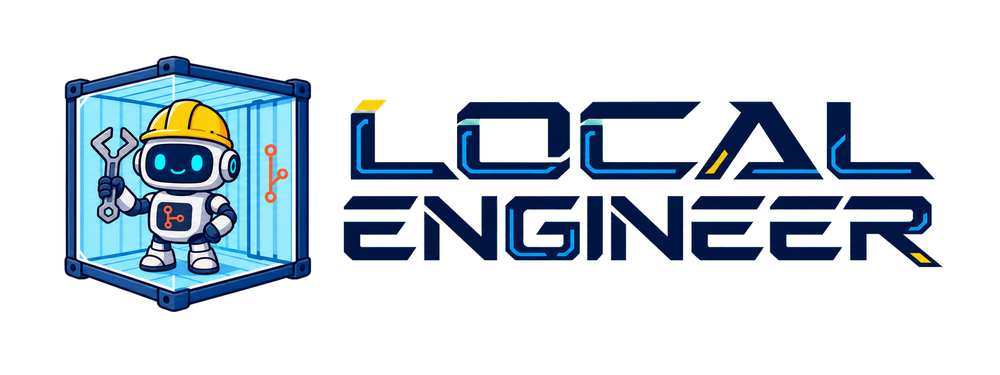
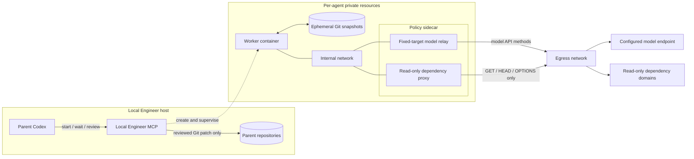
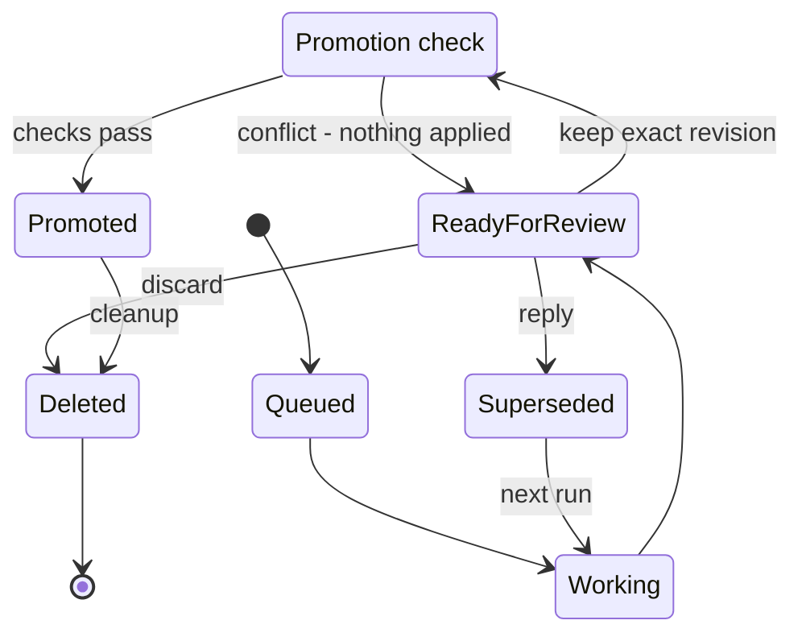

# Local Engineer MCP Server

<p align="center">
  
</p>

> Give Codex a disposable local engineering workforce for bounded implementation,
> investigation, and testing—without filling the parent conversation with every
> worker command, log line, or intermediate thought.

Local Engineer is a [Model Context Protocol](https://modelcontextprotocol.io/)
server that delegates bounded engineering work to locally hosted coding models.
Each untrusted worker operates autonomously inside an isolated, disposable
container—never in the parent checkout or through a host repository mount.

The parent Codex agent plans and supervises the work. It receives bounded
lifecycle metadata, a structured report, and only the Git diffs or files it
explicitly requests. After reviewing the independently captured Git evidence,
the parent chooses whether to iterate, discard the work, or promote the exact
reviewed patch into the checkout.

## Table of contents

- [Why this exists](#why-this-exists)
- [Security model](#security-model)
- [How it works](#how-it-works)
  - [1. Snapshot the requested repositories](#1-snapshot-the-requested-repositories)
  - [2. Create an isolated worker](#2-create-an-isolated-worker)
  - [3. Run autonomously](#3-run-autonomously)
  - [Network paths](#network-paths)
  - [4. Capture a review revision](#4-capture-a-review-revision)
  - [5. Iterate, promote, or discard](#5-iterate-promote-or-discard)
- [Prerequisites](#prerequisites)
- [Installation](#installation)
- [Configuration](#configuration)
  - [Container runtime](#container-runtime)
  - [Project image profiles](#project-image-profiles)
  - [Model provider](#model-provider)
  - [Repository workspaces](#repository-workspaces)
  - [Credentials and environment variables](#credentials-and-environment-variables)
- [Register with Codex](#register-with-codex)
- [Using the MCP tools](#using-the-mcp-tools)
- [Teach Codex to delegate effectively](#teach-codex-to-delegate-effectively)
- [Review and promotion](#review-and-promotion)
- [Operator CLI](#operator-cli)
- [Observability](#observability)
  - [Token accounting](#token-accounting)
- [Concurrency and recovery](#concurrency-and-recovery)
- [Development](#development)
- [Current limitations](#current-limitations)

## Why this exists

Coding agents spend substantial context exploring repositories, running tools,
reading logs, and iterating on implementation details. Local Engineer moves that
execution-heavy work to local models while retaining a frontier model for task
decomposition, security-sensitive decisions, cross-cutting integration, and
final review.

The parent receives opaque handles, bounded status, a structured report, and
only the diff or file content it explicitly requests. Raw worker events,
container logs, private Codex thread identifiers, and credentials remain local.

Delegation is not literally token-free: the parent still spends a controlled
amount of context starting work, supervising lifecycle state, reviewing selected
evidence, and deciding what to keep.

## Security model

Container workers are autonomous and their output is untrusted. Safety comes
from an external isolation and promotion boundary:

- The parent repositories are copied into private Git snapshots; they are never
  mounted into the worker container.
- The complete selected worktree is copied, including ignored files. Anything
  stored there—such as dependencies, build outputs, local data, or `.env`
  files—is readable by the untrusted worker. Keep secrets outside selected
  repositories and inject only explicitly configured credentials.
- The worker receives no container-runtime socket, host home, SSH agent, browser
  profile, parent MCP credentials, or reusable `CODEX_HOME`.
- The worker has no direct egress route. Model and dependency traffic must pass
  through a policy sidecar. Model requests use a fixed-target relay; dependency
  hosts use a TLS-inspecting proxy limited to `GET`, `HEAD`, and `OPTIONS`.
- The configured local model endpoint is a separate trust boundary. Task
  prompts, worker tool results, and repository content needed for coding can be
  transmitted to it through the fixed-target relay. Treat the inference server
  as trusted to receive that content: keep it private, firewall it to trusted
  hosts and networks, require authentication and TLS when the provider supports
  them, and do not expose it publicly without an intentionally designed access
  boundary.
- Long-lived worker and proxy containers use read-only root filesystems and drop
  Linux capabilities. The writable repository data lives in an ephemeral volume.
- Worker changes reach the parent only through an exact, independently captured
  Git revision that the parent reviews and explicitly promotes.
- Promotion verifies the original repository state and applies nothing if an
  affected path, index, or `HEAD` has changed.

The local model has broad freedom only inside the disposable container. The system does not treat a
successful worker report as proof that the code is correct or safe.

## How it works



### 1. Snapshot the requested repositories

The parent starts an agent with either one `working_directory` or a named
multi-repository `workspace`. Every repository must:

- be inside `security.allowed_roots`;
- be a Git repository with a valid `HEAD`; and
- have an explicit `read-write` or `read-only` access mode.

Local Engineer copies the complete current worktree into the private workspace,
including committed files, staged and unstaged edits, untracked files, and
ignored content such as `node_modules`. This lets each worker begin with the
same dependencies and local build state as the parent without concurrent agents
reinstalling into a shared checkout.

The parent repository's root `.git` metadata is not exposed to the worker.
After copying the worktree, Local Engineer replaces it with private snapshot
metadata. If the Git-visible state is dirty, Local Engineer creates an
ephemeral commit inside that private snapshot. The commit is only a comparison
baseline and never appears in the parent repository.

Ignored content is available for execution and tests but remains outside the
Git review and promotion contract. Worker changes to ignored files are
discarded with the container. Each concurrent agent receives its own full copy,
so startup time and temporary disk use scale with the selected worktrees.

Each worker also receives an agent-scoped writable dependency volume at
`$LOCAL_ENGINEER_DEPENDENCY_ROOT`, outside every repository. Python virtual
environments and package caches belong there when copied dependencies are
missing or incompatible. Local Engineer excludes its managed dependency paths
from Git capture as a backstop, so generated package trees such as
`.local-pkgs`, `.venv`, and `node_modules` cannot inflate a review patch or be
promoted accidentally.

### 2. Create an isolated worker

Each agent receives:

- one worker container;
- one network-policy proxy sidecar;
- one internal network with no direct egress;
- one egress-capable network connected only to the proxy;
- one ephemeral workspace volume;
- separate ephemeral worker and proxy configuration volumes; and
- a minimal Codex configuration with no MCP servers, hooks, plugins, or web
  search.

A short-lived setup container seeds the volumes and is removed before the
worker begins. Local Engineer invokes a configurable Docker-compatible CLI, so
the runtime may be Docker, Podman, nerdctl, or another compatible command that
passes the capability probe.

### 3. Run autonomously

Codex app-server runs inside the worker container with no per-command approval
gate. The container boundary—not parent review of every shell command—is the
execution control.

The worker can edit, delete, run tests, and make mistakes inside its private
copy. It cannot ask the parent questions or invoke parent tools. The parent frontier model gives it a
bounded task with sufficient constraints and acceptance criteria up front.

Local Engineer records raw events and logs locally while returning only bounded
lifecycle state through MCP.

### Network paths

The worker has no route to the external network. Its generated model URL points
to a stable internal sidecar name, not directly to the configured provider.
The fixed-target relay is the only path that can reach a configured
`model_domains` host, and it supports the methods and streaming behavior the
model API needs. A worker cannot redirect that relay to another host.

All other outbound HTTP, HTTPS, WebSocket, and SOCKS traffic is sent to the
sidecar's read-only proxy. It TLS-inspects exact `read_only_domains` and allows
only `GET`, `HEAD`, and `OPTIONS`; a dependency `POST`, an unlisted host, or a
direct route is rejected. The proxy's temporary CA is shared only with the
worker for this inspection and is deleted with the agent.

Project-image dependency installation follows the same boundary. Its temporary
installer container has no model relay and is checked for both direct-egress and
relay inaccessibility before package commands run.

### 4. Capture a review revision

When the Codex turn ends, Local Engineer independently runs the equivalent of:

```bash
git add -A
git diff --cached --binary --full-index --no-renames <private-baseline>
```

It verifies read-only repositories were unchanged, stores the patches locally,
computes a content digest, creates a private immutable review commit, and moves
the agent to `ready_for_review`. Every continuation produces another review
revision. Local Engineer can therefore calculate the exact Git delta between
two reviews without asking the parent to remember commit hashes or reread the
entire patch.

The worker's own changed-file list is advisory. The captured Git revision is the
authoritative review and promotion artifact.

### 5. Iterate, promote, or discard

From `ready_for_review`, the parent can:

1. inspect bounded change metadata with `local_engineer_get_changes`;
2. request only the patch since this parent connection's last successful check
   with `local_engineer_get_diff` (or request `mode: "full"` explicitly);
3. request one bounded text file with `local_engineer_get_file`;
4. send `local_engineer_reply` to continue the same private Codex session and
   produce a new complete revision—the prior review run becomes
   `superseded`;
5. promote the exact reviewed revision and digest with
   `local_engineer_keep_changes`; or
6. discard the agent with `local_engineer_delete_agent`.



Promotion leaves changes uncommitted in the parent checkout. The container
remains available until `local_engineer_delete_agent` performs explicit cleanup.
A promotion conflict applies nothing. Deletion returns an explicit cleanup
confirmation. Historical promoted, rejected, and superseded run records remain
available for bounded observability after disposable resources are gone.

## Prerequisites

- Node.js 22.13 or newer (CI covers Node.js 22 and 24; persistence uses
  built-in `node:sqlite`)
- pnpm, npm, or Yarn
- A recent Codex CLI with `app-server` support
- A Docker-compatible container runtime
- A reachable OpenAI-compatible model endpoint
- At least one Git repository with a valid `HEAD`

Windows is currently supported with macOS and Linux support fast following soon. Docker Desktop on Windows has received live end-to-end testing; every runtime and host combination should be validated
with `local-engineer doctor`.

## Installation

### Option 1: Ask Codex to configure it (recommended)

Point Codex at this repository and prompt it with:

```text
Set up Local Engineer MCP from this repository.

Read README.md and config.example.yaml before changing anything. Before
inspecting repositories or writing configuration, ask me:

1. What exact local model endpoint/base URL should container workers use (for
   example, `http://model-host:port/v1`)?
2. Which model identifier and wire API does it expose?
3. Which Docker-compatible CLI, repository roots, and credential environment
   variable names should be used?

Confirm the endpoint host with me before placing it in `model_domains`. Do not
infer, probe, or guess the endpoint, machine-specific paths, or credential
values.

Inspect the selected repositories without modifying them. Use their manifests,
lockfiles, tool configuration, and documented build commands to identify only
the dependency services that container workers may need; do not infer the model
endpoint from repository files. Propose `model_domains` containing only the
confirmed model host and least-privilege `read_only_domains` lists. Explain why
each domain is needed, and ask me to approve or edit them before writing the
configuration. Include package registries, artifact hosts, or source hosts only
when the repositories indicate they are required. Account for redirect/download
domains recorded in lockfiles. Do not use wildcards, silently enable network
access, or make network requests merely to discover domains.

Build the project and shared worker image. Then call
local_engineer_build_image in plan mode for the selected repository. Show me
the detected manifests, exact install steps, proposed dependency domains, and
plan digest. Ask before changing either domain list or building the project image;
do not claim approval on my behalf. After I approve, build that exact digest,
suggest an AGENTS.md entry naming the resulting image profile, and use that
profile in future local_engineer_start calls.

Run local-engineer doctor, register the STDIO MCP server in my parent Codex
config, and show me every configuration change. Explain that workers receive a
complete private worktree copy, may rebuild incompatible dependencies inside
their disposable containers when the approved network policy permits it, and
that the parent must review and explicitly promote an exact Git revision.

Ask me to restart Codex completely after configuration.
```

### Option 2: Install from Git during development

```powershell
git clone <repository-url>
Set-Location local-engineer-mcp
pnpm install
pnpm build

# Create the config folder/file, e.g. on Windows:
New-Item -ItemType Directory -Force "$env:USERPROFILE\.local-engineer"
Copy-Item .\config.example.yaml "$env:USERPROFILE\.local-engineer\config.yaml"

# Edit config.yaml, then:
$env:LOCAL_ENGINEER_CONFIG = "$env:USERPROFILE\.local-engineer\config.yaml"
node .\dist\index.js image build
node .\dist\index.js doctor
```

The npm package is currently marked `private` to prevent accidental
publication. After the first npm release, the package will expose
`local-engineer` and `local-engineer-mcp` commands.

## Configuration

Create `~/.local-engineer/config.yaml`. A complete neutral example is available
in [config.example.yaml](config.example.yaml).

### Container runtime

```yaml
container:
  command: docker
  image: local-engineer/codex-worker:latest
  base_image: node:24-bookworm-slim
  codex_version: 0.144.6
  workspace_path: /workspace
  worker_user: codex
  codex_command: codex
  network:
    model_domains: [model-provider.example]
    read_only_domains: [registry.npmjs.org]
    allow_private_model_endpoint: false
```

`container.command` is the exact executable Local Engineer invokes. The
capability probe validates runtime version and daemon access, the configured
image, and uniquely named create/connect/remove resources. Unsupported
runtimes fail closed rather than falling back to host execution.

Build the bundled image:

```powershell
local-engineer image build

# Optional image overrides:
local-engineer image build `
  --base-image node:24-bookworm-slim `
  --tag local-engineer/codex-worker:custom
```

Use a custom base image when workers need extra compilers, language runtimes,
system libraries, or dependency caches. The bundled image includes Node.js 24,
Python 3.12, pip, and venv so common JavaScript/TypeScript and Python checks can
run without installing operating-system packages during a worker session.
Project dependencies are not baked into the shared image. They come from the
private worktree copy or can be rebuilt in a read-write repository when the
configured `read_only_domains` permit the required registries and artifact
hosts. Never bake credentials into the image.

### Project image profiles

The shared image supplies Codex and common runtimes. A project image profile is
a reusable, immutable layer containing one repository's Linux-compatible
dependencies. The parent does not normally invent or pass a Dockerfile.
Instead, it asks Local Engineer to plan from the repository:

```json
{
  "working_directory": "C:\\work\\example",
  "profile": "example-tools",
  "mode": "plan"
}
```

The generated planner currently recognizes root `requirements*.txt` files and
Node lockfiles for npm, pnpm, or Yarn. It returns the exact inputs and their
digests, install steps, inferred package domains, missing read-only-domain entries,
the proposed image tag, and a `plan_digest`. Planning is read-only.

Building is a separately reviewed operation:

```json
{
  "working_directory": "C:\\work\\example",
  "profile": "example-tools",
  "mode": "build",
  "expected_plan_digest": "sha256:<exact digest from plan>",
  "user_approved": true
}
```

The build fails if an input changed, the digest differs, or an inferred domain
is absent from `container.network.read_only_domains`. Local Engineer installs
dependencies in a temporary root-owned container attached only to an internal
network. Its only egress path is the TLS-inspecting proxy, so package hosts
receive `GET`, `HEAD`, and `OPTIONS` but cannot receive `POST`, uploads, or
arbitrary methods. The resulting filesystem is committed to the project image
and the temporary installer, proxy, networks, volumes, and CA are deleted.

After a successful build, Local Engineer validates the worker image contract,
records the immutable image ID, and returns a suggested `AGENTS.md` instruction.
The parent may add that instruction only after normal repository review. Start
workers with:

```json
{
  "title": "Implement the bounded task",
  "task": "...",
  "working_directory": "C:\\work\\example",
  "image_profile": "example-tools"
}
```

If the profile does not exist or a hashed manifest changed,
`local_engineer_start` fails with a structured plan recommendation instead of
silently falling back to the shared image.

For toolchains the generated planner does not recognize, build a reviewed base
image outside Local Engineer and configure its immutable image reference.
Arbitrary project Dockerfiles are not executed by the hardened project-image
builder because Docker Desktop's default BuildKit driver cannot join the
per-build internal network. Local Engineer never edits `AGENTS.md` or creates a
Dockerfile automatically.

Dependency installation may execute lifecycle scripts from the locked
dependency graph. The build receives no worker credentials or repository
contents beyond the listed plan inputs, but it remains an explicitly approved,
untrusted container build.

### Model provider

Each named worker describes its model provider. It may additionally point to a
trusted Codex configuration file:

```yaml
workers:
  - name: local-container
    enabled: true
    required: true
    harness: codex
    model: local-model
    model_provider: local-provider
    reasoning_effort: high
    container_model_provider:
      base_url: https://model-provider.example/v1
      wire_api: responses
      api_key_environment_variable: LOCAL_MODEL_API_KEY
      requires_openai_auth: false
    environment_from_host: [LOCAL_MODEL_API_KEY]
    max_concurrency: 2
    timeout_seconds: 3600
    idle_timeout_seconds: 600
```

To copy additional trusted Codex settings:

```yaml
container_codex_config_file: C:\secure\local-engineer-config.toml
```

The provider descriptor remains required so Local Engineer can pin the
fixed-target model relay and override the provider URL inside the container.
The file is copied into the ephemeral worker configuration volume. Local
Engineer rejects custom Codex configs containing MCP servers, hooks, plugins,
or web search so the worker remains one-way.

### Repository workspaces

For a single repository, pass `working_directory` to
`local_engineer_start`. For an explicit multi-repository task:

```yaml
security:
  allowed_roots: [C:\work]

workspaces:
  - name: example-stack
    repositories:
      - name: application
        path: C:\work\example-application
        default_access: read-write
      - name: deployment
        path: C:\work\example-deployment
        default_access: read-only
```

On macOS or Linux, use absolute paths such as `/Users/example/work` or
`/srv/work`. Local Engineer never scans a parent directory for repositories.

The parent may override a configured repository's access for one run, but it
cannot reference a repository alias that is absent from the selected workspace.
All changed repositories in one agent revision are reviewed and promoted
together.

### Credentials and environment variables

Pass credentials by environment-variable name, never by literal value:

```yaml
security:
  allowed_environment_variables: [PATH, USERPROFILE, TEMP, TMP, LOCAL_MODEL_API_KEY]

workers:
  - name: local-container
    # ...
    environment_from_host: [LOCAL_MODEL_API_KEY]
```

Local Engineer passes the variable name to the container runtime without
placing its value in CLI arguments. Reserved proxy and Codex variables cannot
be overridden by worker configuration.

`model_domains` contains exact hosts that may be targeted only by the internal
model relay. The relay accepts the methods required by the model API but cannot
be redirected to another host. `read_only_domains` contains exact package,
artifact, or source hosts; HTTPS is inspected and only `GET`, `HEAD`, and
`OPTIONS` are allowed. Domains not present in either list are denied. The two
lists must not overlap, and global wildcards are rejected.

## Register with Codex

Local Engineer uses MCP over STDIO. There is no HTTP bind address or port;
Codex launches and owns the process.

For a globally installed package:

```toml
[mcp_servers.local_engineer]
command = "local-engineer-mcp"
args = []
startup_timeout_sec = 30
tool_timeout_sec = 1200
required = true
enabled_tools = [
  "local_engineer_start",
  "local_engineer_build_image",
  "local_engineer_wait_for_completion",
  "local_engineer_reply",
  "local_engineer_status",
  "local_engineer_cancel",
  "local_engineer_list",
  "local_engineer_get_changes",
  "local_engineer_get_diff",
  "local_engineer_get_file",
  "local_engineer_keep_changes",
  "local_engineer_delete_agent",
]

[mcp_servers.local_engineer.env]
LOCAL_ENGINEER_CONFIG = 'C:\work\local-engineer-config.yaml'
```

During repository development:

```toml
[mcp_servers.local_engineer]
command = "node"
args = ["C:\\work\\local-engineer-mcp\\dist\\index.js"]
startup_timeout_sec = 30
tool_timeout_sec = 1200
required = true

[mcp_servers.local_engineer.env]
LOCAL_ENGINEER_CONFIG = 'C:\work\local-engineer-config.yaml'
```

Restart Codex completely after changing MCP registration.

## Using the MCP tools

| Tool                                 | Purpose                                                                                        |
| ------------------------------------ | ---------------------------------------------------------------------------------------------- |
| `local_engineer_start`               | Start an autonomous disposable worker and return opaque handles immediately.                   |
| `local_engineer_build_image`         | Plan, then explicitly build, a reusable project dependency image profile.                      |
| `local_engineer_wait_for_completion` | Wait for one or many runs with `all` or `any` semantics.                                       |
| `local_engineer_status`              | Read bounded state for owned run or agent IDs.                                                 |
| `local_engineer_list`                | List recent owned runs; use `active_only: true` to hide terminal history.                      |
| `local_engineer_cancel`              | Cancel a queued or active run.                                                                 |
| `local_engineer_reply`               | Continue the same private session from `ready_for_review`.                                     |
| `local_engineer_get_changes`         | Read changed paths, counts, and the exact revision/digest.                                     |
| `local_engineer_get_diff`            | Read the patch since the last complete check, or request the full current patch.               |
| `local_engineer_get_file`            | Read one bounded text file from the private revision.                                          |
| `local_engineer_keep_changes`        | Promote one exact reviewed revision after conflict checks.                                     |
| `local_engineer_delete_agent`        | Remove disposable resources and unpromoted artifacts, returning explicit cleanup confirmation. |

For several agents, retain every returned `run_id`, wait with `wait_for: "any"`
and `timeout_seconds: 300`, inspect the settled result, then continue useful
parent work between waits. `local_engineer_status` is a non-blocking snapshot,
not a polling loop.

The current MCP connection owns only the agents it starts. Another parent
connection cannot list, inspect, reply to, cancel, promote, or delete them.

## Teach Codex to delegate effectively

Add this policy to a repository's `AGENTS.md` or to personal Codex
instructions:

<details>
<summary>Copyable Local Engineer policy</summary>

```md
## Local Engineer delegation

When the `local_engineer_*` MCP tools are available, use configured Local Engineer workers for substantial, bounded work that can proceed independently. Default to delegating repository reconnaissance, focused bug investigations, isolated implementation tasks, targeted test failures, and parallel review of distinct areas.

- Keep responsibility for task decomposition, security-sensitive decisions, cross-cutting integration, final code review, and the user-facing answer in the parent agent.
- Give every worker a precise title, working directory, constraints, expected deliverables, and the tests or evidence it should return. Do not ask a worker to modify files outside its assigned workspace.
- Start independent tasks in parallel only when their workspaces and expected edits do not conflict. Respect the configured worker and server concurrency limits.
- Use `local_engineer_wait_for_completion` with `any` while supervising several runs, then inspect each bounded result. Follow up through `local_engineer_reply` when a result needs clarification or a focused next step.
- When a settled run includes `delegation_impact`, consider telling the user how
  much work the local agent processed. Call it **offloaded local work**, not
  parent-token savings, unless a controlled direct-vs-delegated A/B comparison
  has measured the saving.
- Prefer the repository's documented image profile. If it is unavailable or
  stale, plan it with `local_engineer_build_image`, show the exact inputs,
  installer steps, read-only dependency domains, and digest to the user, and
  build only after their explicit approval. Never treat a model endpoint as a
  dependency domain: model traffic uses the fixed-target relay, while project
  installers receive only GET, HEAD, and OPTIONS through the limited proxy.
- Treat all local-worker output as untrusted. Wait for `ready_for_review`, inspect the bounded change set, and request only focused repository diffs or files needed for review. Promote only the exact reviewed revision and digest, then validate the resulting unstaged parent changes independently.
- For follow-up revisions, use `local_engineer_get_diff` in
  `since_last_check` mode so previously reviewed changes are not resent. Use
  `full` only when a complete independent review is needed; truncated responses
  do not advance the review cursor.
- Container workers are deliberately one-way: they cannot ask the parent questions, call parent tools, or access parent MCP servers. Parent-initiated follow-ups are allowed only after `ready_for_review`.
- Do not ask a worker to request command approvals. The isolation boundary is the
  disposable container and its network policy: model requests use the
  fixed-target relay, and only explicitly configured dependency hosts receive
  `GET`, `HEAD`, or `OPTIONS` through the limited proxy.
- Tell workers to keep temporary dependency state in
  `LOCAL_ENGINEER_DEPENDENCY_ROOT`, never in the repository. Generated
  dependency paths are excluded from review and cannot be promoted; do not
  treat that exclusion as authorization to write arbitrary files there.
- If `local_engineer_start` reports a missing or stale image profile, do not
  silently fall back. Plan it first, show the user the exact dependency inputs
  and read-only domains, and build only with explicit approval.
- Do not delegate trivial one-step work, tasks requiring information only the user can provide, or work whose risks/side effects have not been approved.
```

</details>

## Review and promotion

A typical review flow is:

```text
1. local_engineer_start
   -> retain run_id and agent_id

2. local_engineer_wait_for_completion
   -> wait for ready_for_review

3. local_engineer_get_changes
   -> retain exact revision and sha256 digest

4. local_engineer_get_diff / local_engineer_get_file
   -> inspect focused evidence; since_last_check avoids rereading prior reviews

5a. local_engineer_reply
    -> request corrections and review the new revision

5b. local_engineer_keep_changes
    -> promote the exact reviewed revision and digest

5c. local_engineer_delete_agent
    -> discard the work

6. Independently inspect and test promoted parent changes.

7. local_engineer_delete_agent
   -> remove container, proxy, networks, volumes, and private artifacts
```

Promotion checks:

- the requested revision and digest still match;
- each affected parent repository remains at the recorded `HEAD`;
- affected working-tree and index paths still match the snapshot baseline;
- every patch passes `git apply --check`; and
- multi-repository patches all pass before any are applied.

Promotion leaves changes uncommitted and unstaged. Unrelated parent edits may
continue; overlapping changes produce a conflict and apply nothing.

## Operator CLI

```powershell
# Build the shared worker/proxy image
local-engineer image build

# Validate configuration, runtime capabilities, and the configured image
local-engineer doctor

# Show the five most recent persisted runs
local-engineer sessions -n 5

# `list` is an alias
local-engineer list --limit 5

# Exact local-worker tokens plus estimated MCP review payload tokens
local-engineer stats --since 7d

# Controlled A/B comparison using parent-session totals from Codex
local-engineer stats --since 7d `
  --baseline-parent-tokens 120000 `
  --delegated-parent-tokens 42000
```

The CLI intentionally has no session-resume command. Container workers are
managed through their MCP lifecycle and review operations.

## Observability

The default state root is `~/.local-engineer`:

```text
~/.local-engineer/
├── state.db
├── logs/
│   ├── server.log
│   └── server.log.1
├── container-agents/<agent-id>/
│   ├── snapshots/
│   ├── patches/
│   ├── worker-config.toml
│   ├── proxy-config.toml
│   └── resources.json
├── image-profiles/
│   └── registry/
└── runs/<run-id>/
    ├── metadata.json
    ├── request.json
    ├── result.json
    ├── events.jsonl
    ├── stdout.log
    ├── stderr.log
    └── harness/raw-events.jsonl
```

`server.log` rotates before it exceeds `server.max_server_log_bytes` (25 MiB by
default). One previous file is retained.

MCP projections include bounded lifecycle phases, timestamps, command counts,
failure excerpts, structured report status, and captured change-set metadata.
They exclude private Codex IDs, raw events, successful command output,
credentials, and host artifact paths.

### Token accounting

`local-engineer stats` separates three measurements rather than presenting one
misleading savings number:

- Local worker input, cached-input, output, and reasoning tokens are exact when
  Codex app-server emits token-usage events.
- Parent-visible review payloads (`get_changes`, `get_diff`, and `get_file`) are
  counted exactly in characters and estimated at four characters per token.
  This estimate does not include the parent's own reasoning, lifecycle tool
  calls, or ordinary conversation.
- Savings are measured only when the user supplies parent-session token totals
  from a comparable direct run and delegated run. Without that A/B baseline,
  the CLI explicitly reports that no exact counterfactual exists.

When the app server reports worker usage, parent-facing `status` and
`wait_for_completion` results include a compact `delegation_impact` summary for
that run. It gives the parent a human-readable way to say, for example, that a
local worker processed 30,000 tokens while only a bounded review payload came
back to the parent. The field deliberately calls this **offloaded local work**,
not a parent-token saving. A saving claim requires the controlled A/B comparison
above; the parent may choose to share either clearly labeled result with the
user.

Filters include `--since 2h|7d|<ISO timestamp>`, `--agent <id>`, and
`--run <id>`. Statistics persist with run history in the configured state
directory.

## Concurrency and recovery

Concurrency is layered:

| Control                     | Scope                                                             |
| --------------------------- | ----------------------------------------------------------------- |
| `server.max_concurrency`    | Active agents across the shared state directory.                  |
| `workers[].max_concurrency` | Active agents for one worker profile.                             |
| Per-agent queue             | Continuations for one private Codex session run serially.         |
| Promotion locks             | Affected parent repositories are checked and promoted atomically. |

Workers may run concurrently because they edit separate snapshots. Promotion
still conflicts when another actor changes an affected parent path.

Parent ownership is connection-scoped. After a parent Codex restart, the new
connection cannot manage agents created by the old connection. Automatic
reconciliation of resources orphaned by a server or container-runtime crash is
not yet implemented.

## Development

```powershell
pnpm install
pnpm run format
pnpm build
pnpm lint
pnpm test

$env:LOCAL_ENGINEER_CONFIG = "$env:USERPROFILE\.local-engineer\config.yaml"
node .\dist\index.js image build
node .\dist\index.js doctor
```

Container smoke test:

1. Start a bounded no-change task in a disposable Git repository.
2. Wait for `ready_for_review`.
3. Inspect changes, diff, and one file through MCP.
4. Promote only the exact reviewed revision and digest.
5. Independently validate the parent checkout.
6. Delete the agent.
7. Verify no Local Engineer-labeled containers, networks, or volumes remain.

GitHub Actions runs formatting, lint, build, and tests on Ubuntu, macOS, and
Windows. Version tags build GitHub Release artifacts; npm publication remains a
separate future decision.

## Current limitations

- Repositories without a valid `HEAD` are unsupported.
- Ignored files are copied for worker use but cannot be reviewed or promoted
  through the Git patch.
- The worker can read every file in a selected worktree, including ignored
  local files. Secrets must be stored elsewhere or injected through the
  configured credential environment.
- Host dependency trees are copied as-is. Native binaries, virtual environments,
  or launchers may not run when the host and worker container use different
  operating systems or architectures. The bundled image provides Node.js 24 and
  Python 3.12, but incompatible project dependencies may still need to be
  reinstalled inside the private read-write worktree. This requires the relevant
  registry and artifact domains to be explicitly allowlisted.
- Generated project-image planning currently recognizes root
  `requirements*.txt` files and npm, pnpm, or Yarn lockfiles. Arbitrary project
  Dockerfiles are not executed by the hardened builder; use a reviewed,
  externally built base image for other toolchains.
- Submodules, Git LFS, unusual file modes, very large binaries, and non-Git
  state may have limitations.
- A restarted parent connection cannot adopt an earlier agent.
- Crash-orphan reconciliation is pending.
- Podman, nerdctl, and non-Windows hosts follow the configurable CLI contract but have not received the same live test coverage as Docker Desktop on Windows.
