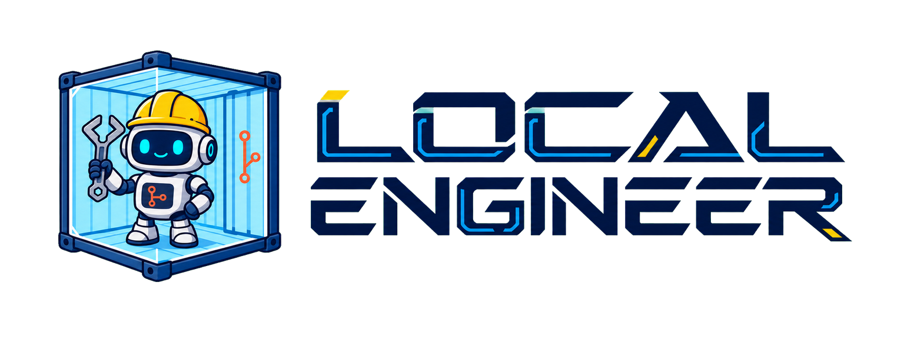
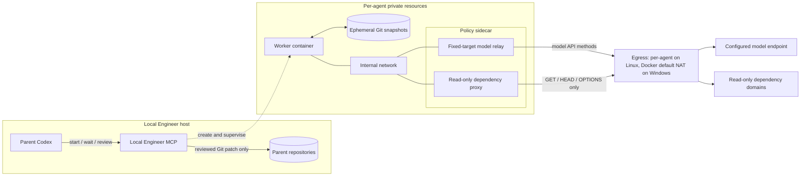
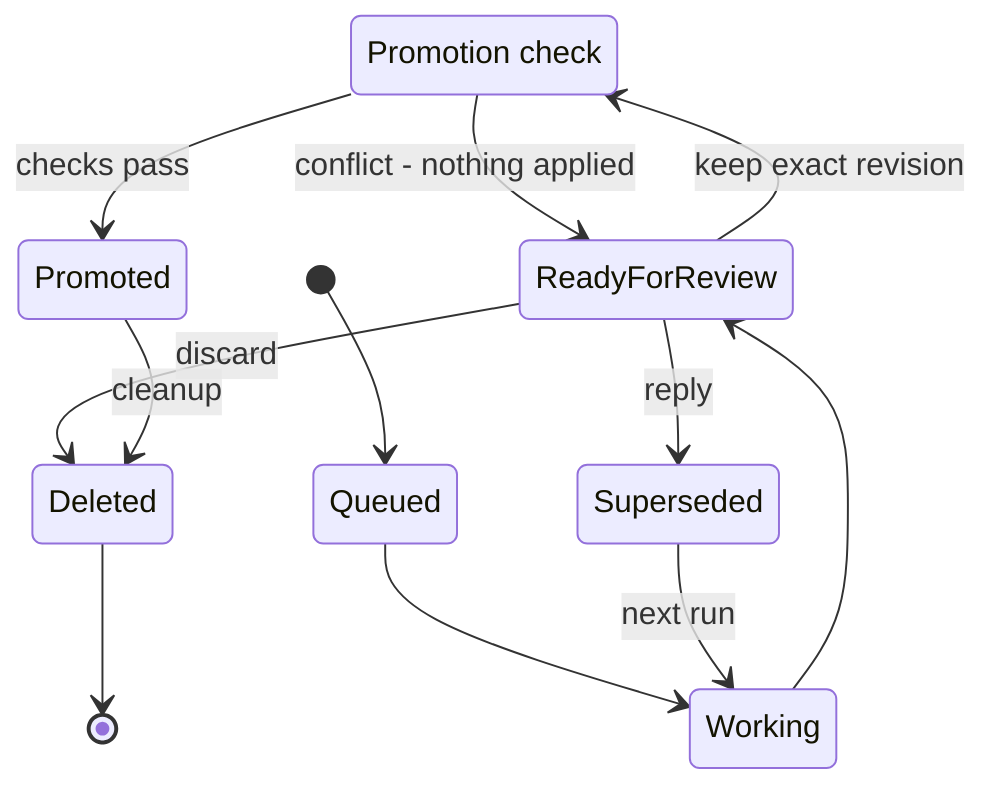

# Local Engineer MCP Server

<p align="center">
  
</p>

> Give Codex a disposable local engineering workforce for bounded implementation,
> investigation, and testing—without filling the parent conversation with every
> worker command, log line, or intermediate thought.

Local Engineer is a [Model Context Protocol](https://modelcontextprotocol.io/)
server that delegates bounded engineering work to locally hosted coding models.
Each untrusted worker operates autonomously inside an isolated, disposable
container—never in the parent checkout or through a direct parent repository checkout mount.

The parent Codex agent plans and supervises the work. It receives bounded
lifecycle metadata, a structured report, and only the Git diffs or files it
explicitly requests. After reviewing the independently captured Git evidence,
the parent chooses whether to iterate, discard the work, or promote the exact
reviewed patch into the checkout.

## Table of contents

- [Why this exists](#why-this-exists)
- [Prerequisites](#prerequisites)
- [Installation](#installation)
- [Teach Codex to delegate effectively](#teach-codex-to-delegate-effectively)
- [Security model](#security-model)
  - [Security - Learn More](#security---learn-more)
- [How it works](#how-it-works)
  - [1. Snapshot the requested repositories](#1-snapshot-the-requested-repositories)
  - [2. Create an isolated worker](#2-create-an-isolated-worker)
  - [3. Run autonomously](#3-run-autonomously)
  - [Network paths](#network-paths)
  - [4. Capture a review revision](#4-capture-a-review-revision)
  - [5. Iterate, promote, or discard](#5-iterate-promote-or-discard)
- [Configuration](#configuration)
  - [Container runtime](#container-runtime)
  - [Docker Desktop Windows containers](#docker-desktop-windows-containers)
  - [Rancher Desktop on Windows](#rancher-desktop-on-windows)
  - [Project image profiles](#project-image-profiles)
  - [Model provider](#model-provider)
  - [Repository workspaces](#repository-workspaces)
  - [Credentials and environment variables](#credentials-and-environment-variables)
- [Register with Codex](#register-with-codex)
- [Using the MCP tools](#using-the-mcp-tools)
- [Review and promotion](#review-and-promotion)
- [Operator CLI](#operator-cli)
- [Observability](#observability)
  - [Token accounting](#token-accounting)
- [Concurrency and recovery](#concurrency-and-recovery)
- [Development](#development)
- [Current limitations](#current-limitations)

## Why this exists

Coding agents spend substantial context exploring repositories, running tools,
reading logs, and iterating on implementation details. Local Engineer moves that
execution-heavy work to local models while retaining a frontier model for task
decomposition, security-sensitive decisions, cross-cutting integration, and
final review.

The parent receives opaque handles, bounded status, a structured report, and
only the diff or file content it explicitly requests. Raw worker events,
container logs, private Codex thread identifiers, and credentials remain local.

Delegation is not literally token-free: the parent still spends a controlled
amount of context starting work, supervising lifecycle state, reviewing selected
evidence, and deciding what to keep.

## Prerequisites

- Node.js 22.13 or newer (CI covers Node.js 22 and 24; persistence uses
  built-in `node:sqlite`)
- pnpm, npm, or Yarn
- A recent Codex CLI with `app-server` support
- A Docker-compatible container runtime
- A reachable OpenAI-compatible model endpoint
- At least one Git repository with a valid `HEAD`

Windows hosts, macOS, and Linux are supported with a compatible container
runtime. Native Windows-container support requires Docker Desktop in Windows
container mode and Hyper-V isolation. Every runtime, host, and container-OS
combination must pass `local-engineer doctor` before use.

## Installation

### Option 1: Ask Codex to configure it (recommended)

Ask Codex to set up Local Engineer for you and help you configure it.

Simply point Codex at this repository and prompt it with:

```text
Set up Local Engineer MCP from this repository.

Read README.md and config.example.yaml before changing anything. Before
inspecting repositories or writing configuration, ask me:

1. What exact local model endpoint/base URL should container workers use (for
   example, `http://model-host:port/v1`)?
2. Which model identifier and wire API does it expose?
3. Which Docker-compatible CLI, repository roots, and credential environment
   variable names should be used?

Confirm the endpoint host with me before placing it in `model_domains`. Do not
infer, probe, or guess the endpoint, machine-specific paths, or credential
values.

Inspect the selected repositories without modifying them. Use their manifests,
lockfiles, tool configuration, and documented build commands to identify only
the dependency services that container workers may need; do not infer the model
endpoint from repository files. Propose `model_domains` containing only the
confirmed model host and least-privilege `read_only_domains` lists. Explain why
each domain is needed, and ask me to approve or edit them before writing the
configuration. Include package registries, artifact hosts, or source hosts only
when the repositories indicate they are required. Account for redirect/download
domains recorded in lockfiles. Do not use wildcards, silently enable network
access, or make network requests merely to discover domains.

Build the project and shared worker image. Then call
local_engineer_build_image in plan mode for the selected repository. Show me
the detected manifests, exact install steps, proposed dependency domains, and
plan digest. Ask before changing either domain list or building the project image;
do not claim approval on my behalf. After I approve, build that exact digest,
suggest an AGENTS.md entry naming the resulting image profile, and use that
profile in future local_engineer_start calls.

Run local-engineer doctor, register the STDIO MCP server in my parent Codex
config, and show me every configuration change. Explain that workers receive a
complete private worktree copy, may rebuild incompatible dependencies inside
their disposable containers when the approved network policy permits it, and
that the parent must review and explicitly promote an exact Git revision.

Ask me to restart Codex completely after configuration.
```

### Option 2: Install from Git during development

```powershell
git clone <repository-url>
Set-Location local-engineer-mcp
pnpm install
pnpm build

# Create the config folder/file, e.g. on Windows:
New-Item -ItemType Directory -Force "$env:USERPROFILE\.local-engineer"
Copy-Item .\config.example.yaml "$env:USERPROFILE\.local-engineer\config.yaml"

# Edit config.yaml, then:
$env:LOCAL_ENGINEER_CONFIG = "$env:USERPROFILE\.local-engineer\config.yaml"
node .\dist\index.js image build
node .\dist\index.js doctor
```

The npm package is currently marked `private` to prevent accidental
publication. After the first npm release, the package will expose
`local-engineer` and `local-engineer-mcp` commands.

## Teach Codex to delegate effectively

Add this policy to a repository's `AGENTS.md` or to personal Codex
instructions:

```md
## Local Engineer delegation

When the `local_engineer_*` MCP tools are available, ALWAYS use configured Local Engineer workers for the bulk of substantial, bounded implementation and investigation that can proceed independently. Default to delegating repository reconnaissance, focused bug investigations, isolated implementation tasks, targeted test failures, and parallel review of distinct areas. Do not silently implement that work in the parent when Local Engineer is unavailable, misconfigured, unhealthy, or missing a required image profile: tell the user exactly what is unavailable and what they need to do to restore delegation, then wait for direction.

- Keep responsibility for task decomposition, security-sensitive decisions, cross-cutting integration, final code review, and the user-facing answer in the parent agent. Review worker code rigorously: inspect focused diffs and files, compare the implementation against requirements and repository conventions, identify bugs or unsafe behavior, request corrections when needed, and independently validate promoted changes.
- Give every worker a precise title, working directory, constraints, expected deliverables, and the tests or evidence it should return. Do not ask a worker to modify files outside its assigned workspace.
- Start independent tasks in parallel only when their workspaces and expected edits do not conflict. Respect the configured worker and server concurrency limits.
- Use `local_engineer_wait_for_completion` with `any` while supervising several runs, then inspect each bounded result. Follow up through `local_engineer_reply` when a result needs clarification or a focused next step.
- When a settled run includes `delegation_impact`, consider telling the user how
  much work the local agent processed. Call it **offloaded local work**, not
  parent-token savings, unless a controlled direct-vs-delegated A/B comparison
  has measured the saving.
- Prefer the repository's documented image profile. If it is unavailable or
  stale, plan it with `local_engineer_build_image`, show the exact inputs,
  installer steps, read-only dependency domains, and digest to the user, and
  build only after their explicit approval. Never treat a model endpoint as a
  dependency domain: model traffic uses the fixed-target relay, while project
  installers receive only GET, HEAD, and OPTIONS through the limited proxy.
- Treat all local-worker output as untrusted. Wait for `ready_for_review`, inspect the bounded change set, and request only focused repository diffs or files needed for review. Promote only the exact reviewed revision and digest, then validate the resulting unstaged parent changes independently.
- For follow-up revisions, use `local_engineer_get_diff` in
  `since_last_check` mode so previously reviewed changes are not resent. Use
  `full` only when a complete independent review is needed; truncated responses
  do not advance the review cursor.
- Container workers are deliberately one-way: they cannot ask the parent questions, call parent tools, or access parent MCP servers. Parent-initiated follow-ups are allowed only after `ready_for_review`.
- Do not ask a worker to request command approvals. The isolation boundary is the
  disposable container and its network policy: model requests use the
  fixed-target relay, and only explicitly configured dependency hosts receive
  `GET`, `HEAD`, or `OPTIONS` through the limited proxy.
- In default `read-only` dependency mode, tell workers to keep temporary dependency state in
  `LOCAL_ENGINEER_DEPENDENCY_ROOT`, never in the repository. In `private-install` mode,
  workers may install dependencies into agent-owned disposable named volumes mounted at
  designated install roots (`node_modules`) on writable repositories, while global/package
  caches remain outside the repository (with the narrow exception of `npm_config_store_dir`
  pre-configured inside the disposable `node_modules` volume on Windows to satisfy pnpm store
  locality without elevated privileges). Generated dependency paths are excluded from review
  and cannot be promoted; do not treat that exclusion as authorization to write arbitrary files there.
- Under Windows `isolated-bind` environments, file-system-sensitive databases (such as workerd SQLite runtime state) encounter fatal disk I/O errors (`SQLITE_IOERR`) when stored on the repository bind mount; direct persistent state to an agent-specific subdirectory of `LOCAL_ENGINEER_DEPENDENCY_ROOT` via `--persist-to`. Long package installations must be bounded with explicit native exit code checks. Background process cleanup must track and terminate only the specific spawned process PID and its descendants; never terminate all Node or workerd processes, which breaks the container MCP file tools server.
- If `local_engineer_start` reports a missing or stale image profile, do not
  silently fall back. Plan it first, show the user the exact dependency inputs
  and read-only domains, and build only with explicit approval.
- Do not delegate trivial one-step work, tasks requiring information only the user can provide, or work whose risks/side effects have not been approved.
```

## Security model

Container workers are autonomous and their output is untrusted. Safety comes
from an external isolation and promotion boundary:

- The parent repository checkout is never mounted into the worker container.
  In `isolated-bind` mode (recommended on Windows), Local Engineer maintains an
  immutable baseline clone on the host and bind-mounts a disposable working
  clone into the worker container, while mounting dependencies read-only.
  In `volume-copy` mode, repositories are copied into private Git snapshots
  and seeded into dedicated Docker named volumes.
- In `volume-copy` mode, the complete selected worktree is copied, including
  ignored files and local build data. In `isolated-bind` mode, discovered dependency
  directories are bind-mounted read-only from the host, while ordinary ignored files
  are omitted from the clone; any file tracked in Git (including tracked `.env`
  files) remains present. In either mode, keep secrets outside selected
  repositories and inject only explicitly configured credentials.
- The worker receives no container-runtime socket, host home, SSH agent, browser
  profile, parent MCP credentials, or reusable `CODEX_HOME`.
- The worker cannot send direct egress. On Linux this is enforced by an internal
  network; on Windows it is enforced inside the Hyper-V utility VM by a
  deny-by-default route table that retains only a `/32` route to the sidecar.
  IPv4/IPv6 subnet, gateway, multicast, and broadcast routes are removed. Model
  and dependency traffic must pass through the policy
  sidecar. Model requests use a fixed-target relay; dependency hosts use a
  TLS-inspecting proxy limited to `GET`, `HEAD`, and `OPTIONS`.
- The configured local model endpoint is a separate trust boundary. Task
  prompts, worker tool results, and repository content needed for coding can be
  transmitted to it through the fixed-target relay. Treat the inference server
  as trusted to receive that content: keep it private, firewall it to trusted
  hosts and networks, require authentication and TLS when the provider supports
  them, and do not expose it publicly without an intentionally designed access
  boundary.
- Linux containers use read-only root filesystems, dropped capabilities, and an
  unprivileged user. Windows containers require `--isolation hyperv`, run
  untrusted work as `ContainerUser`, apply memory/CPU ceilings, protect installed
  tools with NTFS ACLs, and enforce read-only repositories via Docker read-only
  volume mounts (in `volume-copy` mode) or read-only bind mounts (in `isolated-bind`
  mode) with write-probe assertions. Process isolation is never accepted
  for Windows workers.
- Worker changes reach the parent only through an exact, independently captured
  Git revision that the parent reviews and explicitly promotes.
- Promotion verifies the original repository state and applies nothing if an
  affected path, index, or `HEAD` has changed.

The local model has broad freedom only inside the disposable container. The system does not treat a
successful worker report as proof that the code is correct or safe.

### Security - Learn More

For an in-depth breakdown of Local Engineer's security architecture, trusted computing base, and limitations—including Hyper-V isolation, route lockdown, deterministic 10.x subnet allocation, TLS-inspecting dependency proxy, read-only volume mounts, NTFS ACLs, and patch promotion verification—see [SECURITY.md](SECURITY.md).

## How it works


```mermaid
flowchart LR
  subgraph Host["Local Engineer host"]
    P["Parent Codex"]
    M["Local Engineer MCP"]
    R[("Parent repositories")]
  end

  subgraph Private["Per-agent private resources"]
    W["Worker container"]
    V[("Ephemeral Git snapshots")]
    N["Internal network"]
    subgraph X["Policy sidecar"]
      Relay["Fixed-target model relay"]
      Proxy["Read-only dependency proxy"]
    end
  end

  E["Egress: per-agent on Linux, Docker default NAT on Windows"]
  L["Configured model endpoint"]
  D["Read-only dependency domains"]

  P -->|"start / wait / review"| M
  M -.->|"create and supervise"| W
  W <--> V
  W --- N
  N --- Relay
  N --- Proxy
  Relay -->|"model API methods"| E
  Proxy -->|"GET / HEAD / OPTIONS only"| E
  E --> L
  E --> D
  M -->|"reviewed Git patch only"| R
```

### 1. Snapshot the requested repositories

The parent starts an agent with either one `working_directory` or a named
multi-repository `workspace`. Every repository must:

- be inside `security.allowed_roots`;
- be a Git repository with a valid `HEAD`; and
- have an explicit `read-write` or `read-only` access mode.

Repository preparation depends on the configured workspace mode:

- **`isolated-bind` mode (recommended on Windows)**: Local Engineer uses a
  fast three-tier clone model that avoids copying large dependency directories.
  It creates an immutable baseline clone (`snapshots/<name>`) from the parent
  repository checkout and an independent disposable working clone
  (`workspaces/<name>`). Discovered dependency trees (`node_modules`) are
  validated on the host against escaping junctions and bind-mounted read-only
  over the working clone at mirrored paths, while ordinary ignored files are
  omitted from the clone. Startup time and disk use remain minimal because
  heavy dependencies are shared read-only rather than duplicated.
- **`volume-copy` mode**: Local Engineer copies the complete current worktree
  into the private workspace, including committed files, staged and unstaged
  edits, untracked files, and ignored content such as `node_modules`. This lets
  each worker begin with the same dependencies and local build state as the
  parent, but startup time and disk use scale with the size of copied worktrees.

The parent repository's root `.git` metadata is never exposed to the worker.
Local Engineer replaces it with private snapshot or clone metadata. If the
Git-visible state is dirty, Local Engineer creates an ephemeral commit inside
the baseline snapshot. The commit is only a comparison baseline and never
appears in the parent repository.

In `volume-copy` mode, ignored content from the worktree is copied and available
for execution and tests; in `isolated-bind` mode, only discovered dependency
directories (`node_modules`) are mounted read-only, while ordinary ignored files
are omitted. In both modes, ignored content remains outside the Git review and
promotion contract, and worker changes to ignored files cannot be promoted. Each
worker also receives an agent-scoped writable dependency volume
at `$LOCAL_ENGINEER_DEPENDENCY_ROOT`, outside every repository. Python
virtual environments and package caches belong there when pre-existing
dependencies are missing or incompatible. Local Engineer excludes its managed
dependency directories from git status, review diffs, and promotion so generated
artifacts cannot be promoted accidentally.

#### Dependency Modes

Local Engineer supports two dependency modes configurable via `default_dependency_mode` (in configuration) or per-run `dependency_mode` in `local_engineer_start`:

- **`read-only` (default)**: Fast, secure dependency sharing. Discovered host dependency directories (`node_modules`) are mounted read-only into worker containers. Workers cannot mutate host dependencies or install packages directly into the repository.
- **`private-install`**: Disposable, isolated in-container package installations supported across Linux, Windows `isolated-bind`, and Windows `volume-copy` workspace modes. For writable repositories, agent-owned disposable container volumes are mounted at authorized install roots (`node_modules`). Workers can run `pnpm install`, `pnpm add`, or `npm install` without elevation; package managers install into disposable container storage and update `package.json`/lockfiles. Global tool and package caches remain outside repositories in `$LOCAL_ENGINEER_DEPENDENCY_ROOT` (with the narrow exception of `npm_config_store_dir` pre-configured inside the disposable `node_modules` volume on Windows to satisfy pnpm store locality without elevated privileges). Under Windows `isolated-bind` environments, file-system-sensitive databases (such as workerd SQLite runtime state) encounter fatal disk I/O errors (`SQLITE_IOERR`) when stored on the repository bind mount; direct persistent state to an agent-specific subdirectory of `$LOCAL_ENGINEER_DEPENDENCY_ROOT` via `--persist-to`. Long package installations must be bounded with explicit native exit code checks. Background process cleanup must track and terminate only the specific spawned process PID and its descendants; never terminate all Node or workerd processes, which breaks the container MCP file tools server. All managed dependency directories (`node_modules`, `.pnpm-store`, `.venv`, `.local-pkgs`, `.local-engineer-dependencies`, `__pypackages__`) at any directory depth are strictly excluded from staging, review diffs, and host promotion.

### 2. Create an isolated worker

Each agent receives:

- one worker container;
- one network-policy proxy sidecar;
- one worker-side network with direct egress blocked by the platform-specific
  network boundary;
- an egress-capable network connected only to the proxy (per-agent on Linux,
  Docker's shared default `nat` on Windows); the Windows proxy listeners bind
  only to its dedicated private-network IP;
- an isolated workspace: in `volume-copy` mode, an ephemeral workspace named
  volume; in `isolated-bind` mode, a host-backed disposable working clone bind
  mount accompanied by read-only dependency bind mounts;
- separate ephemeral worker and proxy configuration volumes; and
- a minimal Codex configuration with no MCP servers, hooks, plugins, or web
  search.

In `volume-copy` mode, short-lived setup containers seed repository volumes,
configuration, and caches before the worker begins. In `isolated-bind` mode,
repositories are prepared offline on the host without volume copying, while a
consolidated setup container initializes configuration and cache volumes and
applies required permissions. Local Engineer invokes a configurable
Docker-compatible CLI, so the runtime may be Docker, Podman, nerdctl, or
another compatible command that passes the capability probe.

### 3. Run autonomously

Codex app-server runs inside the worker container with no per-command approval
gate. The container boundary—not parent review of every shell command—is the
execution control.

The worker can edit, delete, run tests, and make mistakes inside its private
copy. It uses the worker image's `apply_patch` helper for source edits. The
helper accepts one structured, line-ending-preserving patch format:
`*** Begin Patch`, `*** Add File` / `*** Update File` / `*** Delete File`, and
`*** End Patch`. This avoids weak local models mixing Codex patch markers with
Git diff syntax or miscounting unified-diff hunks. Workers validate non-trivial
patches first with `apply_patch --check`, then submit that exact literal patch;
the helper rejects mixed formats and unmatched context. It cannot ask the parent questions or
invoke parent tools. The parent frontier model gives it a bounded task with
sufficient constraints and acceptance criteria up front.

Local Engineer records raw events and logs locally while returning only bounded
lifecycle state through MCP.

When a wait times out, its pending entries include `live_progress` rather than
just a bare `running` state: whether the worker is executing a command,
producing a message, or awaiting its next action; time since activity; a
container-derived changed-file count; and a short sanitized recent-message
excerpt. Parent agents should continue waiting while that evidence remains
recent and coherent. Raw logs, command output, private thread identifiers, and
source content remain local unless separately requested through bounded review
tools. The excerpt is untrusted progress context, not evidence that an
implementation is correct or ready to promote.

### Network paths

The worker has no route to the external network. Its generated model URL points
to a private sidecar address (a name on Linux, an IP on Windows), not directly
to the configured provider.
The fixed-target relay is the only path that can reach a configured
`model_domains` host, and it supports the methods and streaming behavior the
model API needs. A worker cannot redirect that relay to another host.

Allowed dependency traffic can reach the sidecar's read-only HTTP or SOCKS
proxy through injected `HTTP_PROXY`, `HTTPS_PROXY`, and `ALL_PROXY` settings.
This is not transparent forwarding: clients that ignore those settings must
configure the proxy explicitly. For example, Windows PowerShell can use
`Invoke-WebRequest -Proxy $env:HTTPS_PROXY -Uri https://registry.terraform.io/`.
A direct DNS lookup or unproxied request failing is expected and does not prove
an allowlisted domain is unavailable. The proxy TLS-inspects exact
`read_only_domains` and allows only `GET`, `HEAD`, and `OPTIONS`; a dependency
`POST`, an unlisted host, or a direct route is rejected. The proxy's temporary
CA is shared only with the worker for this inspection and is deleted with the
agent. Do not disable TLS verification to work around a client trust error.

Project-image dependency installation follows the same boundary. Its temporary
installer container has no model relay and is checked for both direct-egress and
relay inaccessibility before package commands run.

### 4. Capture a review revision

When the Codex turn ends, Local Engineer independently runs the equivalent of:

```bash
git add -A
git diff --cached --binary --full-index --no-renames <private-baseline>
```

It verifies read-only repositories were unchanged, stores the patches locally,
computes a content digest, creates a private immutable review commit, and moves
the agent to `ready_for_review`. Every continuation produces another review
revision. Local Engineer can therefore calculate the exact Git delta between
two reviews without asking the parent to remember commit hashes or reread the
entire patch.

The worker's own changed-file list is advisory. The captured Git revision is the
authoritative review and promotion artifact.

### 5. Iterate, promote, or discard

From `ready_for_review`, the parent can:

1. inspect bounded change metadata with `local_engineer_get_changes`;
2. request only the patch since this parent connection's last successful check
   with `local_engineer_get_diff` (or request `mode: "full"` explicitly);
3. request one bounded text file with `local_engineer_get_file`;
4. send `local_engineer_reply` to continue the same private Codex session and
   produce a new complete revision—the prior review run becomes
   `superseded`;
5. promote the exact reviewed revision and digest with
   `local_engineer_keep_changes`; or
6. discard the agent with `local_engineer_delete_agent`.


```mermaid
stateDiagram-v2
  state "Promotion check" as PromotionCheck
  [*] --> Queued
  Queued --> Working
  Working --> ReadyForReview
  ReadyForReview --> Superseded : reply
  Superseded --> Working : next run
  ReadyForReview --> PromotionCheck : keep exact revision
  PromotionCheck --> Promoted : checks pass
  PromotionCheck --> ReadyForReview : conflict - nothing applied
  ReadyForReview --> Deleted : discard
  Promoted --> Deleted : cleanup
  Deleted --> [*]
```

Promotion leaves changes uncommitted in the parent checkout. The container
remains available until `local_engineer_delete_agent` performs explicit cleanup.
A promotion conflict applies nothing. Deletion returns an explicit cleanup
confirmation. Historical promoted, rejected, and superseded run records remain
available for bounded observability after disposable resources are gone.

## Configuration

Create `~/.local-engineer/config.yaml`. A complete neutral example is available
in [config.example.yaml](config.example.yaml).

### Container runtime

```yaml
container:
  command: docker
  platform: linux
  # Optional explicit Docker context; prevents accidental use of a stale Desktop context.
  # context: default
  # Reserved for Local Engineer's per-agent networks; must not overlap your LAN.
  agent_network_pool: 10.240.0.0/16
  image: local-engineer/codex-worker:latest
  base_image: node:24-bookworm-slim
  codex_version: 0.144.6
  workspace_path: /workspace
  worker_user: codex
  codex_command: codex
  network:
    model_domains: [model-provider.example]
    read_only_domains: [registry.npmjs.org]
    allow_private_model_endpoint: false
```

`codex_command: codex` uses the image's fully qualified native Codex executable. This is required for Windows
containers because direct `docker exec` calls cannot launch npm's `codex.cmd` shell shim. A different configured
command is passed through unchanged.

`container.command` is the exact executable Local Engineer invokes. Set
`container.context` when the CLI has more than one daemon—for example, use
`default` for a Rancher Desktop Moby daemon if `docker context ls` shows that
the active Docker Desktop context is unavailable. Local Engineer passes this as
`--context <name>` on every runtime command, so the choice survives new agents
and host restarts. The
capability probe validates runtime version and daemon access, the configured
image, and uniquely named create/connect/remove resources. Unsupported
runtimes fail closed rather than falling back to host execution.

`agent_network_pool` prevents Docker's automatic address allocator from
choosing a private bridge subnet that overlaps a LAN-hosted model endpoint.
Local Engineer derives one private `/24` per Windows agent, or an internal and
egress `/24` pair per Linux agent, from this reserved `/16`; choose a
`10.x.0.0/16` range unused by your LAN, VPN, and model network. On Windows,
the proxy uses Docker Desktop's existing default `nat` network for outbound
traffic. Its private adapter's competing default route is removed and verified
before the worker starts.

### Docker Desktop Windows containers

If you do development on "pure" Windows (instead of WSL/Linux or alternative) and wish to iterate on a Windows-compatible container environment, this section details the Windows container runtime.

Docker Desktop is the trusted container-runtime administrator, not the worker security boundary.

Native Windows workers fail closed unless all of these controls are active:

- the daemon reports `windows` container mode;
- every container is created with Hyper-V isolation and the result is verified
  through container inspection;
- untrusted commands run as `ContainerUser`, never
  `ContainerAdministrator`;
- each Hyper-V utility VM receives explicit memory and CPU ceilings;
- setup containers lose all non-loopback routes before they process repository
  data or initialize volumes; and
- the worker retains only its own address and an on-link `/32` route to the
  current sidecar IP. `ContainerUser` cannot restore privileged routes.

Example:

```yaml
container:
  command: docker
  platform: windows
  context: desktop-windows
  image: local-engineer/codex-worker-windows:0.144.6
  base_image: mcr.microsoft.com/windows/servercore:ltsc2025
  workspace_path: C:/workspace
  worker_user: ContainerUser
  windows_memory_limit: 4g
  windows_cpu_count: 2
  # Workspace mode: 'isolated-bind' (recommended fast mode: three-tier clone with read-only dependency mounts)
  # or 'volume-copy' (schema default: legacy named-volume copy)
  windows_workspace_mode: isolated-bind
```

Build and validate after switching Docker Desktop to Windows containers:

```powershell
$env:LOCAL_ENGINEER_CONFIG = 'C:\work\local-engineer-config.yaml'
pnpm build
node .\dist\index.js image build
node .\dist\index.js doctor
```

The Windows image provides Node.js 24, Python 3.14, Git, Terraform 1.12.2,
Rust, Codex, and the same policy sidecar. Downloaded Node, Rustup, MinGit,
Codex source, and Terraform inputs are pinned by SHA-256. The Rust compiler
version is checked before building the proxy, and the Microsoft Build Tools
bootstrapper must have a valid Microsoft Authenticode signature. Windows
project image profiles are currently rejected rather than falling back to a
weaker build path.

### Rancher Desktop on Windows

Local Engineer works with Rancher Desktop's `dockerd (moby)` container engine.
This workflow uses Linux containers. Use Docker Desktop and the preceding
section for native Windows containers.
This is useful when Rancher Desktop already owns the local Kubernetes and
container workflow: Docker Desktop does not need to be running, and its image
store is separate from Rancher's.

Set `DOCKER_HOST` only on the Local Engineer MCP process so its `docker`
invocations target Rancher's standard Windows named pipe:

```toml
[mcp_servers.local_engineer.env]
LOCAL_ENGINEER_CONFIG = 'C:\\work\\local-engineer-config.yaml'
DOCKER_HOST = 'npipe:////./pipe/docker_engine'
```

Start Rancher Desktop before starting Codex. The MCP registration persists for
new Codex sessions and across PC restarts; the first use after configuring a
different runtime needs its own worker-image build because images are not shared
between Docker Desktop and Rancher Desktop.

Build the bundled image:

```powershell
local-engineer image build

# Optional image overrides:
local-engineer image build `
  --base-image node:24-bookworm-slim `
  --tag local-engineer/codex-worker:custom
```

Use a custom base image when workers need extra compilers, language runtimes,
system libraries, or dependency caches. The bundled image includes Node.js 24,
Python 3.12 with pip and venv, the stable Rust toolchain (`cargo` and `rustc`),
and the Debian Linux development libraries required by Tauri/WebKitGTK builds.
That supports typical JavaScript/TypeScript, Python, Rust, and Tauri project
checks without installing operating-system packages during a worker session.
The Tauri CLI and project-specific Node/Rust dependencies remain project
dependencies: provide them through the copied worktree, an approved project
image profile, or explicitly allowlisted registries. Rebuild the shared worker
image after upgrading Local Engineer before starting a Rust or Tauri worker.
For a Rust project that must fetch crates, add only the exact required hosts to
`read_only_domains`—normally `index.crates.io` and `static.crates.io`; add
`github.com` only for an explicitly used Git dependency. Tauri's JavaScript
packages use the same npm registry policy as other Node projects.
Project dependencies are not baked into the shared image. They come from the
private worktree copy (in `volume-copy` mode) or read-only dependency mounts
(in `isolated-bind` mode), or can be rebuilt in a read-write repository or
`$LOCAL_ENGINEER_DEPENDENCY_ROOT` when the configured `read_only_domains` permit
the required registries and artifact hosts. Never bake credentials into the
image.

### Project image profiles

The shared image supplies Codex and common runtimes. A project image profile is
a reusable, immutable layer containing one repository's Linux-compatible
dependencies. Profiles are currently Linux-only; Windows mode fails closed
with `IMAGE_PROFILE_WINDOWS_UNSUPPORTED`. The parent does not normally invent
or pass a Dockerfile. Instead, it asks Local Engineer to plan from the repository:

```json
{
  "working_directory": "C:\\work\\example",
  "profile": "example-tools",
  "mode": "plan"
}
```

The generated planner recognizes `requirements*.txt`, locked npm/pnpm/Yarn
projects, and locked Cargo projects. If the requested workspace root has no
manifest, it can deterministically select one direct child project directory;
it never recursively scans dependency or build directories. It returns the
exact inputs and their digests, install steps, inferred package domains, missing
read-only-domain entries, the proposed image tag, and a `plan_digest`. Planning
is read-only. Cargo profiles use only `index.crates.io` and `static.crates.io`
by default; Git dependencies remain opt-in and require a separately approved
domain.

Building is a separately reviewed operation:

```json
{
  "working_directory": "C:\\work\\example",
  "profile": "example-tools",
  "mode": "build",
  "expected_plan_digest": "sha256:<exact digest from plan>",
  "user_approved": true
}
```

The build fails if an input changed, the digest differs, or an inferred domain
is absent from `container.network.read_only_domains`. Local Engineer installs
dependencies in a temporary root-owned container attached only to an internal
network. Its only egress path is the TLS-inspecting proxy, so package hosts
receive `GET`, `HEAD`, and `OPTIONS` but cannot receive `POST`, uploads, or
arbitrary methods. The resulting filesystem is committed to the project image
and the temporary installer, proxy, networks, volumes, and CA are deleted.

After a successful build, Local Engineer validates the worker image contract,
records the immutable image ID, and returns a suggested `AGENTS.md` instruction.
The parent may add that instruction only after normal repository review. Start
workers with:

```json
{
  "title": "Implement the bounded task",
  "task": "...",
  "working_directory": "C:\\work\\example",
  "image_profile": "example-tools"
}
```

If the profile does not exist or a hashed manifest changed,
`local_engineer_start` fails with a structured plan recommendation instead of
silently falling back to the shared image.

For toolchains the generated planner does not recognize, build a reviewed base
image outside Local Engineer and configure its immutable image reference.
Arbitrary project Dockerfiles are not executed by the hardened project-image
builder because Docker Desktop's default BuildKit driver cannot join the
per-build internal network. Local Engineer never edits `AGENTS.md` or creates a
Dockerfile automatically.

Dependency installation may execute lifecycle scripts from the locked
dependency graph. The build receives no worker credentials or repository
contents beyond the listed plan inputs, but it remains an explicitly approved,
untrusted container build.

### Model provider

Each named worker describes its model provider. It may additionally point to a
trusted Codex configuration file:

```yaml
workers:
  - name: local-container
    enabled: true
    required: true
    harness: codex
    model: local-model
    model_provider: local-provider
    reasoning_effort: high
    container_model_provider:
      base_url: https://model-provider.example/v1
      wire_api: responses
      # Optional compatibility adapter for model endpoints (e.g. GLM, vLLM, Ollama)
      # that do not support Codex v1/responses namespace tool wrappers.
      # Supported: 'standard' (default) or 'flatten_namespaces'.
      wire_api_compatibility: flatten_namespaces
      api_key_environment_variable: LOCAL_MODEL_API_KEY
      requires_openai_auth: false
    # Optional path to host model catalog JSON file defining custom models/capabilities.
    # Copied into the ephemeral worker configuration volume.
    # Windows: C:\secure\models.json; Linux: /etc/local-engineer/models.json
    model_catalog_json_file: C:\secure\models.json
    environment_from_host: [LOCAL_MODEL_API_KEY]
    auto_compact_token_limit: 120000
    max_concurrency: 2
    timeout_seconds: 3600
    idle_timeout_seconds: 600
```

`auto_compact_token_limit` configures the token threshold at which Codex triggers context compaction. Local Engineer safely injects this as the root-level `model_auto_compact_token_limit` key in generated or custom Codex configs, validated under `codex --strict-config`.

In default standard mode (`wire_api_compatibility: standard`), the relay streams requests and responses directly through as a lightweight passthrough without buffering. `wire_api_compatibility: flatten_namespaces` enables transparent compatibility with local inference engines (such as GLM-5.3-Flash, vLLM, or Ollama) that do not support Codex `v1/responses` namespace tool wrappers. When enabled for `/v1/responses`, requests and responses pass through bounded transformation buffers; the model relay sidecar flattens namespaced tools (e.g., `mcp__file_tools/read_file` -> `mcp__file_tools__ns__read_file`) on outbound requests, rewrites `tool_choice` and conversation history, and unrolls tool calls in responses and SSE event streams back to their expected namespace format. If the upstream model emits an unrecognized tool alias, the relay fails closed: returning generic HTTP 502 (`upstream_error`) before response headers are sent, or abruptly terminating/aborting established SSE streams after headers have been sent, ensuring unmapped or corrupt tool calls are never forwarded. In `flatten_namespaces` mode, tools must use standard function tool definitions; custom tool formats and web search inside namespaces are rejected with HTTP 400.

`model_catalog_json_file` points to an optional trusted host JSON file defining custom model catalog entries and capabilities (e.g. `function_calling`, context limits). It is copied into the worker configuration directory. When used with `wire_api_compatibility: flatten_namespaces`, models must define function tools rather than custom or search tool shapes.

To copy additional trusted Codex settings:

```yaml
container_codex_config_file: C:\secure\local-engineer-config.toml
```

The provider descriptor remains required so Local Engineer can pin the
fixed-target model relay and override the provider URL inside the container.
The file is copied into the ephemeral worker configuration volume. Local
Engineer rejects custom Codex configs containing MCP servers, hooks, plugins,
or web search so the worker remains one-way.

### Repository workspaces

For a single repository, pass `working_directory` to
`local_engineer_start`. For an explicit multi-repository task:

```yaml
security:
  allowed_roots: [C:\work]

workspaces:
  - name: example-stack
    repositories:
      - name: application
        path: C:\work\example-application
        default_access: read-write
      - name: deployment
        path: C:\work\example-deployment
        default_access: read-only
```

On macOS or Linux, use absolute paths such as `/Users/example/work` or
`/srv/work`. Local Engineer never scans a parent directory for repositories.

The parent may override a configured repository's access for one run, but it
cannot reference a repository alias that is absent from the selected workspace.
All changed repositories in one agent revision are reviewed and promoted
together.

### Credentials and environment variables

Pass credentials by environment-variable name, never by literal value:

```yaml
security:
  allowed_environment_variables: [PATH, USERPROFILE, TEMP, TMP, LOCAL_MODEL_API_KEY]

workers:
  - name: local-container
    # ...
    environment_from_host: [LOCAL_MODEL_API_KEY]
```

Local Engineer passes the variable name to the container runtime without
placing its value in CLI arguments. Reserved proxy and Codex variables cannot
be overridden by worker configuration.

`model_domains` contains exact hosts that may be targeted only by the internal
model relay. The relay accepts the methods required by the model API but cannot
be redirected to another host. `read_only_domains` contains exact package,
artifact, or source hosts; HTTPS is inspected and only `GET`, `HEAD`, and
`OPTIONS` are allowed. Domains not present in either list are denied. The two
lists must not overlap, and global wildcards are rejected.

## Register with Codex

Local Engineer uses MCP over STDIO. There is no HTTP bind address or port;
Codex launches and owns the process.

For a globally installed package:

```toml
[mcp_servers.local_engineer]
command = "local-engineer-mcp"
args = []
startup_timeout_sec = 30
tool_timeout_sec = 1200
required = true
enabled_tools = [
  "local_engineer_start",
  "local_engineer_build_image",
  "local_engineer_wait_for_completion",
  "local_engineer_reply",
  "local_engineer_status",
  "local_engineer_cancel",
  "local_engineer_list",
  "local_engineer_get_changes",
  "local_engineer_get_diff",
  "local_engineer_get_file",
  "local_engineer_keep_changes",
  "local_engineer_delete_agent",
]

[mcp_servers.local_engineer.env]
LOCAL_ENGINEER_CONFIG = 'C:\work\local-engineer-config.yaml'
# Optional on Windows when Rancher Desktop runs the dockerd (moby) engine:
# DOCKER_HOST = 'npipe:////./pipe/docker_engine'
```

During repository development:

```toml
[mcp_servers.local_engineer]
command = "node"
args = ["C:\\work\\local-engineer-mcp\\dist\\index.js"]
startup_timeout_sec = 30
tool_timeout_sec = 1200
required = true

[mcp_servers.local_engineer.env]
LOCAL_ENGINEER_CONFIG = 'C:\work\local-engineer-config.yaml'
# Optional on Windows when Rancher Desktop runs the dockerd (moby) engine:
# DOCKER_HOST = 'npipe:////./pipe/docker_engine'
```

Restart Codex completely after changing MCP registration.

## Using the MCP tools

| Tool                                 | Purpose                                                                                        |
| ------------------------------------ | ---------------------------------------------------------------------------------------------- |
| `local_engineer_start`               | Start an autonomous disposable worker and return opaque handles immediately.                   |
| `local_engineer_build_image`         | Plan, then explicitly build, a reusable project dependency image profile.                      |
| `local_engineer_wait_for_completion` | Wait for one or many runs with `all` or `any` semantics.                                       |
| `local_engineer_status`              | Read bounded state for retained opaque run or agent IDs.                                       |
| `local_engineer_summarize_run`       | Generate an advisory summary of run history, command blockers, and changed files.             |
| `local_engineer_list`                | List recent owned runs; use `active_only: true` to hide terminal history.                      |
| `local_engineer_cancel`              | Cancel a queued or active run.                                                                 |
| `local_engineer_reply`               | Continue the same private session from `ready_for_review`.                                     |
| `local_engineer_get_changes`         | Read changed paths, counts, and the exact revision/digest.                                     |
| `local_engineer_get_diff`            | Read the patch since the last complete check, or request the full current patch.               |
| `local_engineer_get_file`            | Read one bounded text file from the private revision.                                          |
| `local_engineer_keep_changes`        | Promote one exact reviewed revision after conflict checks.                                     |
| `local_engineer_delete_agent`        | Remove disposable resources and unpromoted artifacts, returning explicit cleanup confirmation. |

For several agents, retain every returned `run_id`, wait with `wait_for: "any"`
and `timeout_seconds: 300`, inspect the settled result, then continue useful
parent work between waits. `local_engineer_status` is a non-blocking snapshot,
not a polling loop.

### Run Summarization (`local_engineer_summarize_run`)

`local_engineer_summarize_run` provides an advisory summary of a container run, analyzing command executions, failures, changed files, and duration using the configured model provider or deterministic fallback. The trusted host control plane sends bounded stored run evidence directly to the configured model endpoint (not through the worker dependency proxy). All model-generated summary content is advisory and untrusted. Deterministic execution metrics (`commands_count`, `failed_commands_count`, `key_blockers`, `files_changed`, `duration_seconds`) are computed separately and returned alongside the summary. When stream processing limits or file read errors occur, `history_truncated: true` is returned, and command and failure metrics represent observed lower bounds rather than total counts.

Run listing is private to the current MCP connection. Retain the opaque
`run_id` and `agent_id` returned by `local_engineer_start`: an exact handle is
a recovery capability for that one retained agent. This lets the creating
parent continue review, follow-ups, promotion, or deletion when Codex replaces
the STDIO MCP process, without exposing other agents through broad listing.

### Container-Internal File Tools MCP Server

Inside each worker container, Local Engineer registers a dedicated internal MCP server named `file_tools` (`[mcp_servers.file_tools]`) executing directly via absolute Node runtime (`C:/Node/node.exe` on Windows, `/usr/local/bin/node` on Linux) with immutable script placement (`C:/local-engineer/file-tools-server.mjs` on Windows, `/usr/local/lib/local-engineer/file-tools-server.mjs` on Linux). This provides workers with safe, deterministic primitives for workspace inspection and modification:

| Tool | Description & Guarantees |
| :--- | :--- |
| `read_file` | Reads exact raw text slices (preserving exact text and line endings as UTF-8) and returns line metadata in `structuredContent`. Note: decodes content as UTF-8; non-UTF-8 encodings or binary files containing null bytes are not decoded as raw arbitrary bytes. Records freshness hashes and observed character/line ranges in the session read state. |
| `edit_file` | Performs exact unique string replacement in previously read, fresh files. Enforces that edits fall wholly within observed ranges from prior reads (or requires complete file reads), handles CRLF/LF normalization, and updates read state atomically. |
| `write_file` | Atomically creates new files or replaces completely read files using same-directory temporary files with automatic rollback on failure. Rejects partial reads or stale files. |
| `delete_file` | Deletes a regular file within workspace boundaries. Requires a prior complete fresh read of the exact file during the session, using same-directory backup renaming with rollback protection on failure. Directory deletion is forbidden. |
| `move_file` | Relocates regular files within workspace boundaries. Requires source freshness and destination freshness (if overwriting), using backup files with automatic rollback on failure. |
| `copy_file` | Copies regular files within workspace boundaries with destination backup and rollback protection. |
| `grep_files` | Fast workspace file search with literal substring matching by default and safe, timeout-bounded regex matching (terminating ReDoS patterns within 200ms). Enforces strict limits on max results, file size, and scanned bytes. |
| `list_dir` | Traverses workspace directory trees up to bounded depths without shell command execution. |

All operations strictly enforce workspace path confinement, fail closed on missing roots, reject symbolic links and NTFS junction points across all path components, and block access to `.git` repository metadata.

Hard 10 MB (10,485,760 bytes) UTF-8 byte limits are enforced for write content, replacement strings, and final post-edit file sizes, preventing multibyte Unicode expansion bypasses. If a backup cleanup or rollback operation cannot be completed, an explicit error is emitted detailing the recovery path. Retained recovery artifacts remain visible in workspace tools and block host Git capture, ensuring failed mutations require human operator review and cannot be silently promoted.

## Review and promotion

A typical review flow is:

```text
1. local_engineer_start
   -> retain run_id and agent_id

2. local_engineer_wait_for_completion
   -> wait for ready_for_review

3. local_engineer_get_changes
   -> retain exact revision and sha256 digest

4. local_engineer_get_diff / local_engineer_get_file
   -> inspect focused evidence; since_last_check avoids rereading prior reviews

5a. local_engineer_reply
    -> request corrections and review the new revision

5b. local_engineer_keep_changes
    -> promote the exact reviewed revision and digest

5c. local_engineer_delete_agent
    -> discard the work

6. Independently inspect and test promoted parent changes.

7. local_engineer_delete_agent
   -> remove container, proxy, networks, volumes, and private artifacts
```

Promotion checks:

- the requested revision and digest still match;
- each affected parent repository remains at the recorded `HEAD`;
- affected working-tree and index paths still match the snapshot baseline;
- every patch passes `git apply --check`; and
- multi-repository patches all pass before any are applied.

Promotion leaves changes uncommitted and unstaged. Unrelated parent edits may
continue; overlapping changes produce a conflict and apply nothing.

## Operator CLI

```powershell
# Build the shared worker/proxy image
local-engineer image build

# Validate configuration, runtime capabilities, and the configured image
local-engineer doctor

# Show the five most recent persisted runs
local-engineer sessions -n 5

# `list` is an alias
local-engineer list --limit 5

# Exact local-worker tokens plus estimated MCP review payload tokens
local-engineer stats --since 7d

# Controlled A/B comparison using parent-session totals from Codex
local-engineer stats --since 7d `
  --baseline-parent-tokens 120000 `
  --delegated-parent-tokens 42000

# Start the localhost web monitor and open the default browser
local-engineer monitor

# Bind a specific port on 127.0.0.1 without launching the browser
local-engineer monitor --port 9000 --no-open
```

The CLI intentionally has no session-resume command. Container workers are
managed through their MCP lifecycle and review operations.

`local-engineer monitor` starts a localhost web interface that provides live
observability and interactive steering for recent agent runs. It binds strictly
to 127.0.0.1, prints the URL it is serving, and opens the default browser unless
`--no-open` is supplied. `--port <1-65535>` is strictly validated and defaults
to 8899. The process runs until interrupted. See "Monitor web UI" under
Observability for the security boundary.

## Observability

The default state root is `~/.local-engineer`:

```text
~/.local-engineer/
├── state.db
├── logs/
│   ├── server.log
│   └── server.log.1
├── container-agents/<agent-id>/
│   ├── snapshots/
│   ├── patches/
│   ├── worker-config.toml
│   ├── proxy-config.toml
│   └── resources.json
├── image-profiles/
│   └── registry/
└── runs/<run-id>/
    ├── metadata.json
    ├── request.json
    ├── result.json
    ├── events.jsonl
    ├── stdout.log
    ├── stderr.log
    └── harness/raw-events.jsonl
```

`server.log` rotates before it exceeds `server.max_server_log_bytes` (25 MiB by
default). One previous file is retained.

MCP projections include bounded lifecycle phases, timestamps, command counts,
failure excerpts, structured report status, and captured change-set metadata.
Default projections strictly withhold internal container IDs, private tokens,
and raw event streams, while scoped worker inspection tools (`read_message`,
`get_file`, `get_diff`, `summarize_run`) intentionally return bounded,
worker-derived content under explicit size limits.

### Monitor web UI

`local-engineer monitor` renders a live observability and operator interface on
a localhost web page. The page auto-refreshes against bounded JSON endpoints,
distinguishes active, review, and terminal runs, streams live event timelines,
renders exact unified diffs, and provides interactive steering capability.

The monitor operates under an intentional localhost operator capability model:

- **Loopback Authority & DNS Rebinding Protection**: Binds strictly to
  `127.0.0.1` and offers no foreign `--host` option. Every incoming HTTP request
  validates the `Host` authority against the exact loopback listener and port (rejecting
  missing ports when port != 80), rejecting foreign hostnames (`403 Forbidden`) and DNS-rebinding probes.
- **Origin & Fetch Metadata Validation**: Cross-site fetch metadata (`Sec-Fetch-Site:
  cross-site`), foreign origins, and `null` origins are strictly rejected with
  `403 Forbidden` before reading state or body payloads.
- **CSRF Token Mutation & Content-Type Protection**: State-changing endpoints (such as
  `POST /api/runs/:id/steer`) strictly require exact `Content-Type: application/json`
  (rejecting `application/jsonp`) and a per-server cryptographically random
  `X-CSRF-Token` capability token injected directly into same-origin HTML `<meta name="csrf-token">`.
- **Safe DOM Rendering & Content Isolation**: Raw model outputs and worker logs
  are treated as untrusted. Content is HTML-escaped (`esc()`) before markdown
  formatting; DOM nodes are constructed via safe DOM APIs rather than
  unconstrained `innerHTML` attribute interpolations; event handlers use
  programmatic listeners without inline scripts; and dynamic item IDs are
  sanitized via injective character escaping (`safeDomId`), guaranteeing no
  collisions between distinct IDs. The Content-Security-Policy prohibits
  external CDN assets.
- **Bounded Ingestion, LRU Cache & Limits**: Raw-event log ingestion performs
  bounded synchronous chunked reading (64 KiB chunks via `openSync`/`readSync`, 64 KiB line limit,
  50 MiB file scan cap, 50,000 maximum events) with `StringDecoder` multibyte UTF-8 boundary preservation.
  Oversized lines enter a discarding state to prevent forged command injection; trailing partial records
  without newlines at EOF are discarded. An in-memory LRU cache (`RunStore.timelineCache`) caches up to 10
  parsed timelines within a 20 MiB conservative UTF-16 budget, bypassing caching for oversized entries.
  Per-command output is capped at 64 KiB, paginated timeline responses are capped at 2 MiB, query offsets
  and limits are strictly validated with safe-integer checks, and diff reads are capped at 10 MiB per repository
  and 20 MiB aggregate while preserving per-repo summaries.
- **Atomic Fenced Steering Delivery**: Operator steer submissions enqueue into an
  atomic FIFO queue with `MutationFence` validation, advancing a separate `steeringVersion` to reserve
  `fenceToken` strictly for generation/owner changes. Background dispatch claims pending items atomically
  (`pending -> dispatching`). Single-transaction dispatch finalization (`finalizeSteerDispatch`) re-validates
  fence, status, thread, turn, and dispatch claim inside `BEGIN IMMEDIATE`, updating queue/history and appending
  raw events/stderr while holding the write lock. `BEGIN IMMEDIATE` guarantees mutual exclusion across the database
  and raw logs without claiming cross-filesystem rollback atomicity; reconciled orphan dispatches are classified
  as `'uncertain'` without replaying.
- **Exact Revision Isolation**: Diff views strictly isolate the requested
  change-set revision and never fall back to newer or older revision patch
  directories. Missing exact-revision patches return marked unavailable placeholders
  (`patch_type: 'unavailable'`) rather than failing the endpoint. Multi-repository filenames preserve repository identity.

The monitor drives views through server-side pagination. `GET /api/runs`
returns runs newest-first in pages (default 25, hard maximum 100) with an opaque
`next_cursor` and a `has_more` flag. Assistant messages are available at
`GET /api/runs/:run_id/messages`, and live session activity is available at
`GET /api/runs/:run_id/timeline` with tail pagination that preserves prior
scroll and expansion state.

### Token accounting

`local-engineer stats` separates four measurements rather than presenting one
misleading savings number:

- Local worker input, cached-input, output, and reasoning tokens are exact when
  Codex app-server emits token-usage events.
- Parent-visible review payloads (`get_changes`, `get_diff`, and `get_file`) are
  counted exactly in characters and estimated at four characters per token.
  This estimate does not include the parent's own reasoning, lifecycle tool
  calls, or ordinary conversation.
- Parent-to-worker task text is also counted exactly in characters for every
  initial assignment and parent follow-up. The accompanying token number is a
  four-characters-per-token estimate, split into titles, task/reply text, and
  grounding text. Retained historical runs are derived from their persisted
  task/reply fields; new runs persist the accounting directly. This deliberately
  excludes Local Engineer's generated worker policy and framing, so it is a
  proxy for the parent's delegation effort—not a measure of the parent model's
  complete conversation or billable usage.
- Savings are measured only when the user supplies parent-session token totals
  from a comparable direct run and delegated run. Without that A/B baseline,
  the CLI explicitly reports that no exact counterfactual exists.

Parent-facing `status` and `wait_for_completion` results include compact
`delegation_impact` telemetry whenever available. `estimated_savings_tokens` is
an integer: local worker output plus reported reasoning output, minus the
bounded parent-to-worker payload and parent-visible review estimates. It is a
useful compact proxy, not a measured parent-session or billing saving; use the
controlled A/B comparison above for an exact claim.

Filters include `--since 2h|7d|<ISO timestamp>`, `--agent <id>`, and
`--run <id>`. Statistics persist with run history in the configured state
directory.

## Concurrency and recovery

Concurrency is layered:

| Control                     | Scope                                                             |
| --------------------------- | ----------------------------------------------------------------- |
| `server.max_concurrency`    | Active agents across the shared state directory.                  |
| `workers[].max_concurrency` | Active agents for one worker profile.                             |
| Multi-process leases        | Active runs and side-effecting agent operations are leased by `ownerId` with periodic heartbeats. |
| Cleanup-before-release      | Expired worker runs remain capacity-consuming `recovery_required` records until resource cleanup succeeds. |
| Split-brain fencing         | Monotonic `fenceToken` protects recovery, event ingestion, and agent operations from stale processes. |
| Per-agent operation claims  | Reply, promotion, and deletion claim the latest agent record before any external side effect. |
| Promotion locks             | Affected parent repositories are locked during pre-flight check and promotion. |

Workers may run concurrently because they edit separate snapshots. Promotion
still conflicts when another actor changes an affected parent path.

### Multi-process leases and split-brain fencing

When multiple Local Engineer processes share the same state directory:

- **Lease heartbeats**: Active runs and in-flight reply/promotion/deletion claims record `ownerId`, `leaseHeartbeatAt`, and `leaseExpiresAt` (default 30 seconds). A live server process automatically sends periodic heartbeats (every 5 seconds) for its owned records.
- **Transactional reconciliation and cleanup**: During startup or periodic maintenance, `reconcileStaleRuns()` checks for leases that have expired (`leaseExpiresAt <= now`). A worker-backed run is atomically fenced and moved to `recovery_required`; it continues consuming concurrency capacity while the adopting process awaits adapter and container-agent cleanup. Only successful cleanup moves it to `failed` or `cancelled` and releases capacity. Cleanup failure remains `recovery_required` with `requires_user_action: true`. An expired queued run has no worker resources and is cancelled directly.
- **Live-owner preservation**: A live server instance never reclaims or alters active runs belonging to another live instance whose lease is valid, nor can one instance claim or start runs queued by another owner in `tryStart`.
- **Fenced event ingestion**: Raw worker events, completed assistant messages, token accounting, and activity updates are fence-validated while a SQLite immediate transaction excludes reconciliation. SQLite writes are transactional; raw-event and metadata file writes are serialized with that check but cannot be rolled back with the database.
- **Exclusive agent operations**: Reply, promotion, and deletion atomically claim the latest agent run, assign the current owner, and increment its `fenceToken` before retained-container recovery, host promotion, or resource deletion. A competing process fails before performing the external side effect. An ambiguous claimed-operation failure or lease expiry becomes `recovery_required`; further reply, promotion, and deletion claims fail closed until an operator resolves the ambiguous operation. Expiry alone does not prove the old external operation stopped.
- **Fencing tokens**: Reconciliation and agent-operation claims increment `fenceToken`. If a delayed or paused owner attempts to mutate a reclaimed or claimed run, the update is rejected. Recovery state requires an explicit current token, and ordinary terminal-state mutation is forbidden.
- **Legacy record safety**: Pre-lease historical records lacking lease metadata are handled conservatively and preserved (never declared dead on startup).

### Cancellable startup attempts and late-prepare cleanup

Startup operations are fenced by unique attempt identifiers validated across every asynchronous boundary:

- If startup times out or is cancelled while worker container preparation is in-flight, the attempt is immediately marked invalid and the run transitions to `failed` (`STARTUP_TIMEOUT`) or `cancelled`.
- When container preparation resolves late in the background, invalidation is detected before writing `run.container_prepared`, creating an adapter, or starting a turn. The server immediately invokes container cleanup (`manager.cleanup(agentId)`) to release all container and network resources, avoiding orphaned containers and preventing unhandled background rejections.

Run listing is connection-scoped, but completed container agents are retained
with their private snapshots, review commits, and resource manifest. A parent
that retained its opaque `run_id`/`agent_id` can recover an exact agent after a
Codex or MCP-process restart, then inspect diffs/files, continue the same
worker, promote an exact reviewed revision, or discard it. This is capability
access—not discovery: unrelated parents cannot enumerate retained agents.

The first post-restart review operation reattaches to the worker container and
verifies its deterministic resource names and saved snapshot metadata. If
retained state or the container runtime is missing, Local Engineer fails closed
without promoting anything.

## Development

```powershell
pnpm install
pnpm run format
pnpm build
pnpm lint
pnpm test

$env:LOCAL_ENGINEER_CONFIG = "$env:USERPROFILE\.local-engineer\config.yaml"
node .\dist\index.js image build
node .\dist\index.js doctor
```

Container smoke test:

1. Start a bounded no-change task in a disposable Git repository.
2. Wait for `ready_for_review`.
3. Inspect changes, diff, and one file through MCP.
4. Promote only the exact reviewed revision and digest.
5. Independently validate the parent checkout.
6. Delete the agent.
7. Verify no Local Engineer-labeled containers, networks, or volumes remain.

GitHub Actions runs formatting, lint, build, and tests on Ubuntu, macOS, and
Windows. Version tags build GitHub Release artifacts; npm publication remains a
separate future decision.

## Current limitations

- Repositories without a valid `HEAD` are unsupported.
- Ignored files (whether copied into the workspace in `volume-copy` mode or
  supplied via read-only dependency mounts in `isolated-bind` mode) cannot be
  reviewed or promoted through the Git patch.
- In `volume-copy` mode, the worker can read every file in a selected worktree,
  including ignored local files. In `isolated-bind` mode, ordinary ignored files
  (such as untracked local `.env` files) are omitted from the clone, but any
  file tracked in Git (including tracked `.env` files) is present in the
  workspace. In either mode, secrets must be stored outside selected repositories
  or injected through the configured credential environment.
- Host dependency trees are provided as-is (copied in `volume-copy` mode or
  mounted read-only in `isolated-bind` mode). Native binaries, virtual
  environments, or launchers may not run when the host and worker container use
  different operating systems or architectures. The bundled Linux image provides
  Node.js 24 and Python 3.12; the Windows image provides Node.js 24 and Python
  3.14. Incompatible project dependencies may still need to be reinstalled
  inside the private read-write worktree or `$LOCAL_ENGINEER_DEPENDENCY_ROOT`.
  This requires the relevant registry and artifact domains to be explicitly
  allowlisted.
- The shared image provides Rust and Linux Tauri build prerequisites, not every
  project dependency or platform target. Cross-compilation, mobile targets,
  platform-specific signing, and dependency registries such as crates.io still
  require an approved project image/profile and exact allowlisted domains.
- Generated project-image planning recognizes `requirements*.txt`, locked
  npm/pnpm/Yarn projects, and locked Cargo projects. It can select one direct
  child project when the workspace root itself has no manifest. Arbitrary
  project Dockerfiles are not executed by the hardened builder; use a reviewed,
  externally built base image for other toolchains.
- Submodules, Git LFS, unusual file modes, very large binaries, and non-Git
  state may have limitations.
- Windows project image profiles are not supported.
- Native Windows-container mode requires Docker Desktop and Hyper-V isolation;
  process-isolated Windows containers are intentionally unsupported.
- Podman, nerdctl, and other runtime/host combinations follow the configurable
  CLI contract but may not have the same live test coverage.
