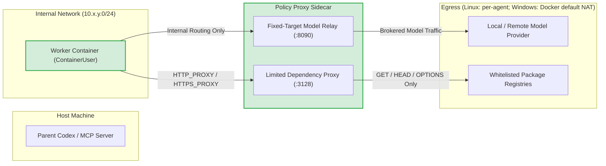

# Local Engineer Security Architecture & Policy

Local Engineer delegates autonomous engineering tasks to locally hosted coding models. Because models can make mistakes, hallucinate commands, or execute untrusted code during development and testing, **all container workers are treated as untrusted**.

Security in Local Engineer does not rely on model obedience or prompt-based guardrails. It is enforced through **hard virtualization boundaries, deny-by-default network routing, fine-grained filesystem ACLs, and strict host review gates**.

---

## 1. Threat Model & Core Security Invariants

Local Engineer enforces five core security invariants:

1. **No Ambient Host Credential Exposure**: Containers never receive the host Docker socket (`docker.sock` / named pipe), SSH agents, host `HOME` or `USERPROFILE`, browser cookies, or parent MCP credentials. A worker can receive only environment variables explicitly allowed by configuration; this can include a model-provider API key when the operator chooses to expose one.
2. **Zero Direct Parent Repository Mounts**: The user's active host Git repository is **never mounted directly** into any worker container. Depending on workspace mode:
   - In `volume-copy` mode, repositories are copied into private, ephemeral Docker named volumes (`le-<suffix>-repo-...`).
   - In `isolated-bind` mode, an immutable baseline clone is kept offline under private agent state, a disposable working clone is bind-mounted read/write, and verified dependency directories (`node_modules`) are bind-mounted read-only over the working clone. The parent repository working tree is never exposed to the worker container.
3. **No Direct Egress**: The worker container cannot route traffic directly to the Internet, local area networks (LANs), or cloud metadata endpoints (`169.254.169.254`). All outbound traffic must pass through a policy proxy sidecar.
4. **Least-Privilege Container Identity**: Untrusted code executes exclusively as an unprivileged user (`ContainerUser` on Windows, non-root `codex` on Linux). Initial filesystem provisioning runs in a short-lived setup container destroyed before the worker boots. Trusted route setup in the live worker and proxy containers, and post-run read-only repository integrity checks, execute as `ContainerAdministrator` under strictly enforced safe working directories and fully qualified system paths.
5. **Independently Verified Promotion**: Code written by a local worker reaches the parent repository only through an exact, cryptographic Git patch revision that the parent supervisor explicitly reviews and promotes.

---

## 2. Execution & Virtualization Boundary

Local Engineer supports both Linux and Windows container runtimes with platform-native isolation:

| Security Dimension | Linux Containers | Windows Containers |
| :--- | :--- | :--- |
| **Virtualization Boundary** | Linux Namespaces + cgroups | **Hardware-enforced Hyper-V Utility VM (`--isolation hyperv`)**<br>Each worker container runs inside an independent virtual machine partition with its own isolated Windows kernel. |
| **Process Isolation** | N/A | **Explicitly Forbidden**<br>`assertWindowsHyperVIsolation()` inspects the container configuration and aborts with `CONTAINER_WINDOWS_HYPERV_REQUIRED` if process isolation is attempted. |
| **Resource Limits** | `--pids-limit 512`<br>`--tmpfs /tmp:rw,nosuid,nodev,size=1g` | **Hyper-V Partition Ceilings**<br>`--cpu-count 2` and `--memory 4g` enforced directly by the Hyper-V hypervisor. |
| **Capability Dropping** | `--cap-drop ALL`<br>`--security-opt no-new-privileges` | Windows NT security descriptor model with unprivileged token. |
| **User Identity** | Unprivileged `codex` (`1000:1000`) | **`ContainerUser` (`*S-1-5-93-2-2`)**<br>Verified at runtime via `whoami /groups` to confirm non-membership in `BUILTIN\Administrators` (`S-1-5-32-544`). |
| **Root Filesystem** | `--read-only` (ephemeral tmpfs for `/tmp`) | Windows container writable layer. Critical installed tooling is protected from `ContainerUser` by NTFS ACLs and checked by `doctor`; workspace and state use named volumes (in `volume-copy` mode) or disposable working clone bind mounts (in `isolated-bind` mode). |

> [!IMPORTANT]
> **Hyper-V Kernel Boundary**: Hyper-V isolation gives Windows workers a stronger kernel boundary than process-isolated Windows containers. It does not make escape impossible: Docker Desktop, Hyper-V, the host OS, and their vulnerability/patch state remain trusted parts of the boundary.

---

## 3. Network Architecture & Deny-by-Default Egress

### Worker and Sidecar Networks

On Linux, each agent provisions dedicated internal and egress networks. On Windows, each new agent provisions one dedicated `10.x.y.0/24` private NAT network and attaches only its trusted proxy sidecar to Docker Desktop's existing default `nat` network for outbound access:
- **`internalNetwork` (`${prefix}-internal`)**: Connects the worker container to the proxy sidecar. The worker is **only** attached to this network.
- **Egress**: A per-agent `${prefix}-egress` network on Linux, or the shared Docker `nat` network on Windows. The worker is **never** attached to either egress network.

The Windows proxy's model relay and dependency proxy bind only to its fixed private-network IP, not `0.0.0.0` or its shared NAT IP. Before the worker starts, `configure-proxy-network.ps1` removes the proxy's competing private-network default route and verifies that the default NAT adapter is its sole outbound gateway. Existing retained agents created under older schemas keep their previous network topology until deleted.



### Windows Network Routing Surgery

Because the Docker NAT driver on Windows does not provide a native `--internal` flag, Local Engineer applies kernel routing table surgery inside the worker container via `container/configure-worker-network.ps1`:

1. **Default Gateway Removal**: `route.exe delete 0.0.0.0 mask 0.0.0.0` removes the default route, blocking all outbound traffic to the Internet or host.
2. **Subnet & Broadcast Route Deletion**: Deletes broadcast (`255.255.255.255`), multicast (`224.0.0.0/4`), and local subnet routes.
3. **IPv6 Lockdown**: Removes link-local and multicast routes on the worker interface, then rejects any remaining non-loopback route except the interface's own link-local `/128` address.
4. **Single `/32` Host Route**: Installs an explicit on-link `/32` route to the proxy sidecar container IP.
5. **Verification**: Parses the effective IPv4 and IPv6 route tables and emits `LOCAL_ENGINEER_NETWORK_OK` only when no unexpected route remains. Configuration fails closed on ambiguous or unparseable state.

### Deterministic Subnet Allocation

To prevent IP collisions with corporate LANs, VPNs, or private model provider addresses, private networks are deterministically allocated from a configurable `10.240.0.0/16` pool using `agentNetworkSubnetCandidates()`. Linux also allocates a per-agent egress `/24`; Windows uses Docker's existing default NAT subnet for egress. The configured pool and Docker NAT subnet must not overlap the model LAN or VPN routes.

---

## 4. Traffic Brokering & Sidecar Inspection

All outbound communication from the worker must pass through the proxy sidecar:

### A. Fixed-Target Model Relay (`:8090/v1`)
- Accepts standard OpenAI-compatible completions/chat JSON-RPC requests.
- Relays requests **only** to the specifically configured model provider `base_url`.
- Cannot be redirected by worker processes to target any other host, port, or protocol.

### B. Limited Dependency Proxy (`:3128`)
- Injects `HTTP_PROXY` and `HTTPS_PROXY` pointing to the sidecar.
- These settings are advisory to clients, not transparent interception. The worker has no direct Internet or external DNS route; a client that ignores the proxy variables must explicitly select the proxy. A failed direct DNS lookup or unproxied request is expected, not evidence that an allowlisted host is blocked by the proxy. Keep TLS verification enabled with the injected CA settings.
- **Strict Method Whitelist**: Permits only `GET`, `HEAD`, and `OPTIONS`. All write methods (`POST`, `PUT`, `DELETE`, `PATCH`) return `403 Forbidden`.
- **Exact Domain Whitelisting**: Only exact hosts listed in `read_only_domains` (e.g. `registry.npmjs.org`, `pypi.org`, `crates.io`, `registry.terraform.io`, `learn.microsoft.com`, `developers.cloudflare.com`, `nodejs.org`) are permitted. Wildcards and unlisted hosts are rejected.
- **No Unlisted Dependency Hosts**: Dependency traffic is limited to exact configured hosts. Operators must treat every listed host, including any private IP address they explicitly list, as trusted.

---

## 5. Filesystem Permissions & Tamper Resistance

### Setup Container vs. Worker Container Separation

1. **Volume Seeding & Baseline Initialization**: In `volume-copy` mode, short-lived setup containers mount empty named volumes, copy private host Git snapshots, overlay ignored dependency data, and initialize configuration and caches. In `isolated-bind` mode, repositories are prepared offline on the host without volume copying: an immutable baseline clone and a disposable working clone are initialized in agent state, while setup containers seed only configuration and cache volumes.
2. **Administrative Lockdown**: In `volume-copy` mode, the setup container sets filesystem ownership and strict permissions: on Linux `chown -R 1000:1000 /workspace` and `0:0` on read-only repositories; on Windows applies NTFS security descriptors to writable directories, provisions dedicated repository named volumes, and configures read-only repositories. In `isolated-bind` mode, NTFS ACLs are applied to the disposable working clone on the host prior to container execution.
3. **Setup Container Destruction & Live Worker Execution**: The setup container is deleted before the worker container runs. However, administrative work does not occur exclusively in disposable setup containers: trusted control-plane operations also run as `ContainerAdministrator` inside the live worker container for initial network routing configuration and post-run read-only integrity checks. Because privileged commands execute inside the live worker container, working directory lockdown and binary path qualification are strictly enforced.

### Windows Filesystem Security: Workspace Modes and NTFS ACLs

Local Engineer supports two workspace architectures on Windows:

#### Mode 1: `volume-copy` (Legacy Named-Volume Mode)
- **Dedicated Repository Named Volumes**:
  Each repository is allocated an independent Docker named volume (`le-<suffix>-repo-<slug>-<hash>`).
- **Read-Only Repositories (Docker `,readonly` Volume Mounts)**:
  Enforced using Docker's native read-only volume mount:
  ```cmd
  --mount "type=volume,src=le-<suffix>-repo-<name>-<hash>,dst=C:/workspace/<name>,readonly"
  ```
  Enforced at the Hyper-V VHD / filesystem driver level. In addition, `ContainerAgentManager.assertWindowsRepositoryMounts()` executes a write probe (`.local-engineer-read-only-probe-*`) as `ContainerUser` immediately after container launch and fails closed if the write is not rejected (`EACCES`, `EPERM`, or `EROFS`).
  After the worker turn completes, `ContainerAgentManager.capture()` verifies repository integrity using `git status --porcelain=v1` as `ContainerAdministrator` to ensure no changes were introduced.

#### Mode 2: `isolated-bind` (Fast, Hardened Clone & Bind Mode)
- **Three-Tier Filesystem Architecture**:
  1. **Immutable Baseline Clone**: A standalone `git clone --no-hardlinks` maintained on the host under the agent's private state directory. It is never mounted into any container.
  2. **Disposable Working Clone**: Cloned from the baseline via `git clone --no-hardlinks` and bind-mounted read/write into the Hyper-V worker container at a mirrored drive `C:` path (e.g., `C:/repos/<name>`). The host checkout is never mounted.
  3. **Read-Only Dependency Mounts**: Discovered dependency directories (`node_modules`) are validated on the host and bind-mounted `,readonly` over the working clone.
- **Host Escape Prevention & Reparse-Point Hardening**:
  - **Worker Freeze During Review**: `ContainerAgentManager.capture()` inspects the worker container's running state (`isContainerRunning`). On Windows, where Hyper-V Utility VMs do not support `docker pause` (returning `0x32`), running containers are strictly stopped via `stopContainer()` and verified stopped (`isContainerRunning === false`) before host Git inspection, eliminating TOCTOU races where untrusted worker code might alter junctions or files mid-diff. If stopping fails or the container remains running, `capture()` fails closed immediately with `CONTAINER_STOP_FAILED`. On Linux, running containers are strictly paused via `pauseContainer()` before host inspection; if pausing fails, `capture()` fails closed immediately. If the container was already verified stopped, execution is already completely frozen. Once host inspection completes and review commits are recorded in the immutable baseline Git object store, `unpauseContainer()` safely unfreezes the worker if it was paused on Linux.
  - **Recursive Reparse-Point Rejection**: Before host Git touches the working clone, `assertNoReparsePoints()` recursively inspects the entire directory tree. Any symbolic link, junction, or unreadable directory/file fails closed immediately with `CONTAINER_PATCH_INVALID:reparse_point_detected` or `unreadable_directory`/`unreadable_path`.
  - **Immutable Git Object Database `getFile`**: File retrieval via `getFile()` extracts content directly from the immutable review commit object in the host Git object database using `git cat-file -p` (verifying `blob` type via `cat-file -t`) against `baselineGitDir` in `isolated-bind` mode (and in-container `git cat-file` in `volume-copy` mode). The host never reads working clone files directly from the filesystem during review, ensuring that post-capture mutations or directory tampering cannot alter file contents returned to the supervisor.
  - **Permitted Source Root Confinement**: `ContainerRuntime.buildBindMount()` strictly verifies that every bind mount source path originates within authorized directories (`agentState/workspaces` for working clones; parent repository roots for dependency mounts).
- **Stale Dependency Manifest Enforcement**:
  Modifying dependency manifests (`package.json`, `pnpm-lock.yaml`, `yarn.lock`, etc.) marks the change set with `dependency_manifest_stale: true`. Stale status is persisted in `dependency-manifest-stale.json` and verified during agent recovery against tampering. Promotion via `keepChanges()` fails closed with `PROMOTION_DEPENDENCY_MANIFEST_STALE` unless the operator explicitly passes `allow_stale_dependencies: true`.

- **Workspace Root & Writable Repositories**:
  ```cmd
  icacls.exe C:\workspace /grant:r *S-1-5-93-2-2:(OI)(CI)M /T /C
  icacls.exe <repoPath> /grant:r *S-1-5-93-2-2:(OI)(CI)M /T /C
  ```
  `ContainerUser` (`*S-1-5-93-2-2`) receives recursive Modify (`M`) access on `C:\workspace` and each writable repository directory. The `(OI)(CI)` (Object Inherit / Container Inherit) flags ensure that files and directories created by Git, compilers, or tools during execution automatically inherit full Modify permissions, while snapshot files seeded by `ContainerAdministrator` are fully accessible to `ContainerUser`.
- **Installed Toolchain Immutability**:
  All installed execution tooling paths (`C:\local-engineer`, `C:\Node`, `C:\Python`, `C:\MinGit`, `C:\Terraform`, `C:\Rust`, `C:\npm`, `C:\BuildTools`, `C:\src`) have their inheritance stripped and are locked down to Read & Execute (`RX`) for `ContainerUser`:
  ```cmd
  icacls.exe $toolRoot /inheritance:r /grant:r '*S-1-5-18:(OI)(CI)F' '*S-1-5-93-2-1:(OI)(CI)F' '*S-1-5-93-2-2:(OI)(CI)RX'
  icacls.exe "$toolRoot\*" /reset /T /C /Q
  ```
  The capability probe (`local-engineer doctor`) verifies that `ContainerUser` write attempts to these toolchain directories fail with `LOCAL_ENGINEER_IMAGE_LOCKED`.

- **Privileged Execution Isolation & Immutable WORKDIR**:
  The Windows container `WORKDIR` is set to immutable `C:\local-engineer` (`*S-1-5-93-2-2:(OI)(CI)RX`), preventing untrusted workers from dropping executable files into the default working directory. In addition, `ContainerRuntime.execContainer()` strictly enforces that all administrative commands executed via `docker exec` run with the safe administrative working directory (`C:/Windows/System32` on Windows, `/` on Linux; any conflicting caller-supplied workdir fails closed with `CONTAINER_PRIVILEGED_WORKDIR_UNSAFE`) and invoke tools via fully qualified paths (`C:/MinGit/cmd/git.exe`, `C:/Windows/System32/WindowsPowerShell/v1.0/powershell.exe`, `C:/Windows/System32/whoami.exe`). This prevents binary planting attacks where an untrusted worker drops replacement executables in `C:\workspace` to hijack privileged operations.

### Codex CLI PATH Shadowing Mitigation

On Windows startup, the Codex CLI attempts to create per-session directories in `$CODEX_HOME/tmp/arg0` to inject batch file aliases that override commands in `PATH`.

As compatibility hardening, Local Engineer locks down this path during configuration volume seeding:
```powershell
New-Item -ItemType Directory -Force "$CODEX_HOME/tmp"
New-Item -ItemType File -Force "$CODEX_HOME/tmp/arg0"
Set-ItemProperty -Path "$CODEX_HOME/tmp/arg0" -Name IsReadOnly -Value $true
icacls.exe "$CODEX_HOME/tmp" /deny "*S-1-5-93-2-2:(DC)"
icacls.exe "$CODEX_HOME/tmp/arg0" /deny "*S-1-5-93-2-2:(D,WDAC,WO)"
```
This reduces accidental PATH-alias replacement. It is not a security boundary: isolation relies on Hyper-V, the unprivileged token, route policy, ACL-protected installed tools, and host-side promotion checks.

---

## 6. Host Repository Protection & Promotion Verification

When a worker produces changes, the parent agent inspects structured diffs and review metadata before deciding whether to keep them.

When `keepChanges` is invoked, `promoteRepositoryChanges()` executes multi-tier verification before modifying the host:

1. **Cross-Process File Locking**: Acquires `.lock` files on affected host repositories.
2. **Revision & Digest Confirmation**: Confirms that the target revision number and SHA-256 patch digest match the reviewed state.
3. **HEAD Commit Verification**: Confirms that the host repository `HEAD` has not diverged since the snapshot was taken.
4. **Worktree & Index Fingerprinting**: Confirms that the parent repository's working tree files and Git index stages have not been modified during the run.
5. **Dry-Run Validation**: Executes `git apply --check --binary` across all affected repositories to verify clean application prior to modifying any host files.
6. **Multi-Repository Promotion & Rollback**: Applies patches sequentially across the target repositories. If any patch application fails in a multi-repository change set, previously applied patches are rolled back using `reversePatch()`. If any rollback step fails, an explicit `PROMOTION_ROLLBACK_INCOMPLETE` error is raised detailing the partially modified repositories rather than silently discarding the failure. (Multi-repository Git promotion is not a distributed ACID transaction; pre-flight dry-runs and automated reverse-patching minimize divergence risk.)

---

## 7. Diagnostic Health Probes (`local-engineer doctor`)

Before executing delegated tasks, the operator CLI provides a comprehensive capability probe:

```powershell
local-engineer doctor
```

The probe verifies:
- Docker daemon responsiveness and OS platform match.
- Worker base image inspect and architecture compatibility.
- Hyper-V isolation capability on Windows (`--isolation hyperv`).
- Utility VM CPU core and memory hardware ceilings.
- Deterministic 10.x private-network creation on Windows (dual-network creation on Linux) and presence of Docker's default Windows NAT network.
- Routing table lockdown and route stripping (`LOCAL_ENGINEER_NETWORK_OK`).
- Unprivileged user identity verification: confirms `ContainerUser` is not a member of `BUILTIN\Administrators` (it does not prove exclusive membership in `BUILTIN\Users`).
- Effective CPU and memory limits from Docker inspection.
- Denied `ContainerUser` writes to the ACL-protected installed-tool directory.
- Best-effort cleanup of all probe containers, networks, and volumes individually attempted in `finally` (cleanup is not atomic).

---

## 8. Trusted Computing Base and Limitations

- Docker Desktop and anyone able to control its daemon have host-administrator-equivalent power.
- Hyper-V isolation is a strong boundary, not a guarantee against unknown container, hypervisor, or host vulnerabilities. Keep all layers patched.
- Windows does not use Docker's read-only-root option here. The container has a writable sandbox layer; installed Local Engineer tooling is protected with NTFS ACLs and verified by the capability probe.
- The proxy sidecar is trusted. A vulnerability that compromises it could reach its egress network, although it has no workspace volume. On Windows the egress network is Docker's shared default NAT; private-IP-only listener binding prevents ordinary peers on that shared NAT from directly using the sidecar, but Docker/HNS and host routing remain trusted boundary components.
- The configured model endpoint receives task prompts, tool output, and repository content needed for the task. Treat it as trusted for that data.
- In `volume-copy` mode, ignored files inside selected repositories are copied into the worker volume. In `isolated-bind` mode, ignored dependency trees (`node_modules`) are excluded from the baseline and mounted read-only, while other ignored files (like `.env`) are excluded from Git tracking in the baseline clone. Regardless of mode, operators should keep secrets outside selected repositories.
- Explicitly allowed environment variables are exposed to untrusted worker code. Use narrowly scoped, short-lived credentials where possible.

---

## 9. Multi-Process Concurrency, Leases, and Fencing

When multiple Local Engineer processes share the same host state directory:

1. **Process Isolation & Mutual Exclusion**: Each Local Engineer server instance operates under a distinct, ephemeral `ownerId`. Live server instances cannot claim an active run whose owner lease remains valid.
2. **Lease-Based Liveness & Heartbeats**: Active runs and in-flight agent operations are leased for a bounded duration (`leaseExpiresAt`, 30 seconds default). A live server issues periodic heartbeats inside SQLite transactions (`BEGIN IMMEDIATE`). When a server process terminates or crashes, heartbeats cease.
3. **Cleanup-Before-Release Recovery**: `reconcileStaleRuns()` moves an expired worker-backed run to `recovery_required` and increments its `fenceToken` inside an immediate transaction. That state continues to consume global and worker concurrency capacity. The adopting server awaits adapter shutdown and container-agent cleanup before changing the run to `failed` or `cancelled`; only then is capacity released. A cleanup error remains `recovery_required`, sets `requiresUserAction`, records a bounded diagnostic, and continues blocking capacity. An expired queued run has no worker resources and can be cancelled directly.
4. **Transactional Event Fencing**: Worker raw-event capture, completed-message insertion, token accounting, and activity updates are fence-validated under one `BEGIN IMMEDIATE` transaction. Reconciliation cannot interleave with that check, so a stale event writes none of those artifacts. SQLite writes are atomic; raw-event and metadata files written during ingestion are not part of the SQLite transaction and cannot be rolled back with it.
5. **Agent Operation Claims**: Reply, promotion, and deletion first claim the latest agent run inside an immediate transaction. A claim assigns the new owner, increments the fencing token, and durably names the operation before retained-container recovery, host promotion, or deletion begins. Competing processes fail before those external side effects. Failure or lease expiry after a claim moves the run to `recovery_required` with explicit user action. All further operation claims, including deletion, are rejected while a settled operation remains ambiguous: lease expiry does not prove the previous external side effect has stopped.
6. **Split-Brain Fencing**: Reclamation and operation claims increment a monotonic `fenceToken`. Mutations from a delayed, paused, or revived process using an obsolete token are rejected. Recovery state also requires an explicit token, and ordinary mutation of terminal states remains forbidden.
7. **Cancellable Startup Attempt Boundaries**: Startup attempts validate attempt validity at every asynchronous step (`probe`, `prepare`, `update`, `adapter`, session start). If an attempt times out or is cancelled, any late-resolving container preparation immediately triggers container cleanup (`cleanup(agentId)`), preventing orphaned containers and unhandled background promise rejections.
