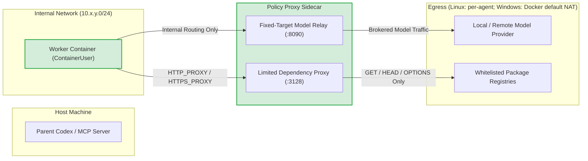

# Local Engineer Security Architecture & Policy

Local Engineer delegates autonomous engineering tasks to locally hosted coding models. Because models can make mistakes, hallucinate commands, or execute untrusted code during development and testing, **all container workers are treated as untrusted**.

Security in Local Engineer does not rely on model obedience or prompt-based guardrails. It is enforced through **hard virtualization boundaries, deny-by-default network routing, fine-grained filesystem ACLs, and strict host review gates**.

---

## 1. Threat Model & Core Security Invariants

Local Engineer enforces five core security invariants:

1. **No Ambient Host Credential Exposure**: Containers never receive the host Docker socket (`docker.sock` / named pipe), SSH agents, host `HOME` or `USERPROFILE`, browser cookies, or parent MCP credentials. A worker can receive only environment variables explicitly allowed by configuration; this can include a model-provider API key when the operator chooses to expose one.
2. **Zero Direct Parent Repository Mounts**: The user's active host Git repository is **never mounted directly** into any worker container. Depending on workspace and dependency mode:
   - In `volume-copy` mode, repositories are copied into private, ephemeral Docker named volumes (`le-<suffix>-repo-...`).
    - In `isolated-bind` mode, an immutable baseline clone is kept offline under private agent state, a disposable working clone is bind-mounted read/write, and selected host dependencies (`node_modules`) are exposed read-only over the working clone in default `read-only` dependency mode. In `private-install` dependency mode, agent-owned disposable named volumes mount at designated install roots (`node_modules`) on writable repositories, enabling in-container package installations without host exposure or elevated privileges. Package and tool caches (`PIP_CACHE_DIR`, `npm_config_cache`, `YARN_CACHE_FOLDER`, and default `npm_config_store_dir`) reside outside repositories under `$LOCAL_ENGINEER_DEPENDENCY_ROOT`; on Windows in `private-install` mode, `npm_config_store_dir` is directed inside the primary disposable `node_modules` volume (`${primaryTarget.containerPath}/.pnpm-store`) resolved against the active working repository so that pnpm recognizes the store as project-internal and avoids unprivileged cross-volume junction creation, while remaining fully isolated, excluded from review, and persisting only in retained agent volumes until explicit agent cleanup. Under Windows `isolated-bind` environments, file-system-sensitive databases (such as workerd SQLite runtime state) encounter fatal disk I/O errors (`SQLITE_IOERR`) when stored on the repository bind mount; persistent database state must be directed to an agent-specific subdirectory of `$LOCAL_ENGINEER_DEPENDENCY_ROOT` via `--persist-to`. Package installations must be bounded with explicit native exit code checks. Background process cleanup must track and terminate only the specific spawned process PID and its descendants; never terminate all Node or workerd processes, which breaks the container MCP file tools server. The parent repository source tree is never exposed to the worker container.
3. **No Direct Egress**: The worker container cannot route traffic directly to the Internet, local area networks (LANs), or cloud metadata endpoints (`169.254.169.254`). All outbound traffic must pass through a policy proxy sidecar.
4. **Least-Privilege Container Identity**: Untrusted code executes exclusively as an unprivileged user (`ContainerUser` on Windows, non-root `codex` on Linux). Initial filesystem provisioning runs in a short-lived setup container destroyed before the worker boots. Trusted route setup in the live worker and proxy containers, and post-run read-only repository integrity checks, execute as `ContainerAdministrator` under strictly enforced safe working directories and fully qualified system paths.
5. **Independently Verified Promotion**: Code written by a local worker reaches the parent repository only through an exact, cryptographic Git patch revision that the parent supervisor explicitly reviews and promotes.

---

## 2. Execution & Virtualization Boundary

Local Engineer supports both Linux and Windows container runtimes with platform-native isolation:

| Security Dimension | Linux Containers | Windows Containers |
| :--- | :--- | :--- |
| **Virtualization Boundary** | Linux Namespaces + cgroups | **Hardware-enforced Hyper-V Utility VM (`--isolation hyperv`)**<br>Each worker container runs inside an independent virtual machine partition with its own isolated Windows kernel. |
| **Process Isolation** | N/A | **Explicitly Forbidden**<br>`assertWindowsHyperVIsolation()` inspects the container configuration and aborts with `CONTAINER_WINDOWS_HYPERV_REQUIRED` if process isolation is attempted. |
| **Resource Limits** | `--pids-limit 512`<br>`--tmpfs /tmp:rw,nosuid,nodev,size=1g` | **Hyper-V Partition Ceilings**<br>`--cpu-count 2` and `--memory 4g` enforced directly by the Hyper-V hypervisor. |
| **Capability Dropping** | `--cap-drop ALL`<br>`--security-opt no-new-privileges` | Windows NT security descriptor model with unprivileged token. |
| **User Identity** | Unprivileged `codex` (`1000:1000`) | **`ContainerUser` (`*S-1-5-93-2-2`)**<br>Verified at runtime via `whoami /groups` to confirm non-membership in `BUILTIN\Administrators` (`S-1-5-32-544`). |
| **Root Filesystem** | `--read-only` (ephemeral tmpfs for `/tmp`) | Windows container writable layer. Critical installed tooling is protected from `ContainerUser` by NTFS ACLs and checked by `doctor`; workspace and state use named volumes (in `volume-copy` mode) or disposable working clone bind mounts (in `isolated-bind` mode). |

> [!IMPORTANT]
> **Hyper-V Kernel Boundary**: Hyper-V isolation gives Windows workers a stronger kernel boundary than process-isolated Windows containers. It does not make escape impossible: Docker Desktop, Hyper-V, the host OS, and their vulnerability/patch state remain trusted parts of the boundary.

> [!NOTE]
> **Platform Validation Status & Lifecycle**: Windows container execution and Hyper-V isolation are verified live in Hyper-V containers on the host machine. Linux container execution, file permissions, ownership transitions (`chown -R codex`, `chmod 0644/0444`), and capability drop configurations (`--cap-add CHOWN` for setup, non-root `codex` without `CHOWN` for workers) are verified exclusively via unit and integration regression test suites using mocked execution; no live Linux validation has been performed, and user namespaces are not used on Linux. Administrative control-plane operations (such as initial network routing table surgery and post-run read-only integrity checks) execute as `ContainerAdministrator` inside the live Windows worker container under strictly enforced safe working directories and fully qualified system paths. Disposable named volumes for `private-install` dependencies persist with the retained agent until explicit agent cleanup (`deleteAgent()` / `cleanup()`), and receive control-plane ACL provisioning strictly during pre-worker setup on empty volumes, with zero live privileged recursive ACL modification permitted.

---

## 3. Network Architecture & Deny-by-Default Egress

### Worker and Sidecar Networks

On Linux, each agent provisions dedicated internal and egress networks. On Windows, each new agent provisions one dedicated `10.x.y.0/24` private NAT network and attaches only its trusted proxy sidecar to Docker Desktop's existing default `nat` network for outbound access:
- **`internalNetwork` (`${prefix}-internal`)**: Connects the worker container to the proxy sidecar. The worker is **only** attached to this network.
- **Egress**: A per-agent `${prefix}-egress` network on Linux, or the shared Docker `nat` network on Windows. The worker is **never** attached to either egress network.

The Windows proxy's model relay and dependency proxy bind only to its fixed private-network IP, not `0.0.0.0` or its shared NAT IP. Before the worker starts, `configure-proxy-network.ps1` removes the proxy's competing private-network default route and verifies that the default NAT adapter is its sole outbound gateway. Existing retained agents created under older schemas keep their previous network topology until deleted.



### Windows Network Routing Surgery

Because the Docker NAT driver on Windows does not provide a native `--internal` flag, Local Engineer applies kernel routing table surgery inside the worker container via `container/configure-worker-network.ps1`:

1. **Default Gateway Removal**: `route.exe delete 0.0.0.0 mask 0.0.0.0` removes the default route, blocking all outbound traffic to the Internet or host.
2. **Subnet & Broadcast Route Deletion**: Deletes broadcast (`255.255.255.255`), multicast (`224.0.0.0/4`), and local subnet routes.
3. **IPv6 Lockdown**: Removes link-local and multicast routes on the worker interface, then rejects any remaining non-loopback route except the interface's own link-local `/128` address.
4. **Single `/32` Host Route**: Installs an explicit on-link `/32` route to the proxy sidecar container IP.
5. **Verification**: Parses the effective IPv4 and IPv6 route tables and emits `LOCAL_ENGINEER_NETWORK_OK` only when no unexpected route remains. Configuration fails closed on ambiguous or unparseable state.

### Deterministic Subnet Allocation

To prevent IP collisions with corporate LANs, VPNs, or private model provider addresses, private networks are deterministically allocated from a configurable `10.240.0.0/16` pool using `agentNetworkSubnetCandidates()`. Linux also allocates a per-agent egress `/24`; Windows uses Docker's existing default NAT subnet for egress. The configured pool and Docker NAT subnet must not overlap the model LAN or VPN routes.

---

## 4. Traffic Brokering & Sidecar Inspection

All outbound communication from the worker must pass through the proxy sidecar:

### A. Fixed-Target Model Relay (`:8090/v1`)
- Accepts standard OpenAI-compatible completions/chat JSON-RPC requests.
- Relays requests **only** to the specifically configured model provider `base_url`.
- Cannot be redirected by worker processes to target any other host, port, or protocol.
- **Relay Modes: Standard Passthrough vs. Opt-In Transformation**:
  - In default standard mode (`wire_api_compatibility: standard`), requests and responses stream directly through as a lightweight, unbuffered proxy.
  - In opt-in `wire_api_compatibility: flatten_namespaces` mode for `/v1/responses`, requests and responses pass through bounded transformation buffers to inspect, flatten, and restore tool schemas for models without native namespace support.
- **Wire API Compatibility & Namespace Flattening (`wire_api_compatibility: flatten_namespaces`)**:
  When workers interact with model providers (e.g. GLM-5.3-Flash, vLLM, Ollama) that do not support Codex `v1/responses` namespace tool wrappers:
  - **Deterministic Alias Transformation**: Flattens nested namespace tools into function tools using `ns__ns__name` aliases on outbound requests. Rewrites `tool_choice`, `allowed_tools`, and conversation history `input` items.
  - **Strict Request-Local vs. Worker-Scoped Identity Cache Separation**: Disaggregates `currentRequestMapping` (strictly request-local tools declared in `body.tools` or `additional_tools`) from `historyMapping` (current tools plus prior approved declarations from `historyRegistry`). The `historyRegistry` is an in-memory, per-relay-instance/worker-scoped identity cache (not persistent across sidecar restarts, and not specific to an individual Codex conversation thread). Formerly declared tools that are omitted in compaction requests (`tools: []`) are authorized strictly for history rewriting; they cannot be selected via `tool_choice` or invoked by upstream model responses.
  - **Transactional Identity Cache & Bounded Insertion-Order Eviction**: Session history entries are staged during request parsing and committed to `historyRegistry` strictly after full request validation succeeds. Any validation failure triggers automatic rollback without mutating cache state. The cache is bounded to `MAX_HISTORY_REGISTRY_ENTRIES = 256` using insertion-order eviction with refresh on tool re-declaration (not on history reads). Evicted historical identities fail closed with HTTP 400 (`UNKNOWN_HISTORY_TOOL`) if later encountered in history.
  - **Genuine MCP Alias Verification**: Restricts bidirectional aliases (`mcp__<server>` <-> `<server>`) strictly to identities proven by trusted MCP configuration (`trustedMcpServers`, defaulting to `file_tools`). Legitimately declared arbitrary namespaces remain supported; however, unapproved prefix aliases, built-in function disguises (`functions`), and unrelated prefixes (`custom__`) are strictly rejected.
  - **Strict Delimiter & Component Validation**: In `tool_choice` and `allowed_tools`, flattened tool references require exactly one reserved delimiter (`__ns__`) with non-empty valid alphanumeric components. Trailing segments (`__ns__extra`), empty components (`__ns__read_file`, `mcp__file_tools__ns__`), non-string names, and untrusted prefixes fail closed with HTTP 400 (`INVALID_TOOL_CHOICE` or `INVALID_TOOL_CHOICE_UNREGISTERED_TOOL`).
  - **Bidirectional Stream Unrolling**: Parses incoming JSON bodies and SSE chunk streams, restoring tool calls to their original namespace format expected by the worker Codex client.
  - **Fail-Closed Alias Invariant**: If an upstream model generates an unrecognized flattened namespace alias containing `__ns__` (one not declared in the incoming request's namespaces), the relay fails closed: returning a generic HTTP 502 (`upstream_error`) before response headers are sent, or immediately destroying/aborting established SSE responses after headers have been sent. Unrecognized flattened namespace aliases are never forwarded to the worker client (plain top-level function calls without namespaces are passed through without unflattening validation).
  - **Hard Memory Limits & Resource Bounding**: Enforces strict request body limits (`8 MB`), JSON response limits (`8 MB`), SSE event limits (`8 MB`), SSE queue memory limits (`8 MB`), and concurrent in-flight limits (`4 requests`). Per-event byte boundaries prevent memory exhaustion on un-delimited streams while allowing coalesced events.
  - **Stream Decompressor Resilience**: Inbound compressed streams (gzip/deflate) handle decompressor errors cleanly by returning HTTP 502 before headers, or terminating/aborting established SSE streams and destroying child streams without crashing the process. Backpressure on the worker response pauses both decompressed and upstream streams.
  - **Strict Tool Shape Validation**: In `flatten_namespaces` mode, top-level custom tools (such as `apply_patch`) are converted into standard function tool format for upstream model compatibility. However, custom tools, nested namespaces, or web search inside a namespace block fail closed with HTTP 400 (`UNSUPPORTED_CUSTOM_TOOL`, `NESTED_NAMESPACE_UNSUPPORTED`, `UNSUPPORTED_SEARCH_TOOL`).

### B. Limited Dependency Proxy (`:3128`)
- Injects `HTTP_PROXY` and `HTTPS_PROXY` pointing to the sidecar.
- These settings are advisory to clients, not transparent interception. The worker has no direct Internet or external DNS route; a client that ignores the proxy variables must explicitly select the proxy. A failed direct DNS lookup or unproxied request is expected, not evidence that an allowlisted host is blocked by the proxy. Keep TLS verification enabled with the injected CA settings.
- **Strict Method Whitelist**: Permits only `GET`, `HEAD`, and `OPTIONS`. All write methods (`POST`, `PUT`, `DELETE`, `PATCH`) return `403 Forbidden`.
- **Exact Domain Whitelisting**: Only exact hosts listed in `read_only_domains` (e.g. `registry.npmjs.org`, `pypi.org`, `crates.io`, `registry.terraform.io`, `learn.microsoft.com`, `developers.cloudflare.com`, `nodejs.org`) are permitted. Wildcards and unlisted hosts are rejected.
- **No Unlisted Dependency Hosts**: Dependency traffic is limited to exact configured hosts. Operators must treat every listed host, including any private IP address they explicitly list, as trusted.

### C. Host Control Plane Run Summarization

`local_engineer_summarize_run` executes entirely on the trusted host control plane:
- **Direct Model Access**: Bounded, stored run evidence is sent directly to the worker's configured model endpoint (not through the worker container's proxy sidecar).
- **Prompt Injection Defense**: Immutable summarizer policy is placed strictly in `instructions` (for Responses API) or `system` messages (for Chat API), explicitly defining evidence as untrusted data rather than supervisory instructions. Evidence content is bounded (command strings <= 512 bytes, error excerpts <= 300 bytes, total prompt <= 32 KiB, summary output <= 16 KiB).
- **Advisory Output**: All model-generated summary text is marked advisory and untrusted (`summary_advisory: true`). Deterministic facts (`commands_count`, `failed_commands_count`, `key_blockers`, `files_changed`, `duration_seconds`) are computed directly by the host runtime. When limits or read errors occur, `history_truncated: true` explicitly signals that command and failure metrics are partial lower bounds.
- **Credential & Upstream Error Protection**: Model provider API keys configured via `api_key_environment_variable` are read from the host environment and sent via `Authorization: Bearer` headers without being logged. Non-2xx upstream response bodies and raw network exception messages are never reflected into `model_summary_error` or tool returns, returning only stable status codes or generic network error categories to prevent leaking tokens, sentinel values, or internal network topology.
- **Bounded Ingestion**: Model response bodies are stream-bounded to 1 MB before JSON parsing, and TLS verification is never disabled.

---

## 5. Filesystem Permissions & Tamper Resistance

### Setup Container vs. Worker Container Separation

1. **Volume Seeding & Baseline Initialization**: In `volume-copy` mode, short-lived setup containers mount empty named volumes, copy private host Git snapshots, overlay ignored dependency data, and initialize configuration and caches. In `isolated-bind` mode, repositories are prepared offline on the host without volume copying: an immutable baseline clone and a disposable working clone are initialized in agent state, while setup containers seed configuration, cache volumes, and any private-install dependency named volumes, and apply working clone ACLs inside the setup container.
2. **Administrative Lockdown**: In `volume-copy` mode, the setup container sets filesystem ownership and strict permissions: on Linux `chown -R 1000:1000 /workspace` and `0:0` on read-only repositories; on Windows applies NTFS security descriptors to writable directories, provisions dedicated repository named volumes, and configures read-only repositories. In `isolated-bind` mode, NTFS ACLs are applied inside a consolidated setup container binding working clones at `C:/setup-workspaces/repo-N`, not executed directly on the host. Early container mount and label checks verify resource ownership before privileged network execs, with a narrow exception for the shared Docker default `nat` network on Windows.
3. **Setup Container Destruction & Live Worker Execution**: The setup container is deleted before the worker container runs. However, administrative work does not occur exclusively in disposable setup containers: trusted control-plane operations also run as `ContainerAdministrator` inside the live worker container for initial network routing configuration and post-run read-only integrity checks. Because privileged commands execute inside the live worker container, working directory lockdown and binary path qualification are strictly enforced.

> [!NOTE]
> **Filesystem Validation Notice**: Linux container filesystem permissions, ownership transitions (`chown -R codex`, `chmod 0644/0444`), and capability drops are verified via unit and integration regression test suites using mocked execution. Windows NTFS security descriptors, inheritance stripping, and ACL lockdowns were verified live in Hyper-V containers on the host machine.

### Windows Filesystem Security: Workspace Modes and NTFS ACLs

Local Engineer supports two workspace architectures on Windows:

#### Mode 1: `volume-copy` (Legacy Named-Volume Mode)
- **Dedicated Repository Named Volumes**:
  Each repository is allocated an independent Docker named volume (`le-<suffix>-repo-<slug>-<hash>`).
- **Read-Only Repositories (Docker `,readonly` Volume Mounts)**:
  Enforced using Docker's native read-only volume mount:
  ```cmd
  --mount "type=volume,src=le-<suffix>-repo-<name>-<hash>,dst=C:/workspace/<name>,readonly"
  ```
  Enforced at the Hyper-V VHD / filesystem driver level. In addition, `ContainerAgentManager.assertWindowsRepositoryMounts()` executes a write probe (`.local-engineer-read-only-probe-*`) as `ContainerUser` immediately after container launch and fails closed if the write is not rejected (`EACCES`, `EPERM`, or `EROFS`).
  After the worker turn completes, `ContainerAgentManager.capture()` verifies repository integrity using `git status --porcelain=v1` as `ContainerAdministrator` to ensure no changes were introduced.

#### Mode 2: `isolated-bind` (Fast, Hardened Clone & Bind Mode)
- **Three-Tier Filesystem Architecture**:
  1. **Immutable Baseline Clone**: A standalone `git clone --no-hardlinks` maintained on the host under the agent's private state directory. It is never mounted into any container.
  2. **Disposable Working Clone**: Cloned from the baseline via `git clone --no-hardlinks` and bind-mounted read/write into the Hyper-V worker container at a mirrored drive `C:` path (e.g., `C:/repos/<name>`). The host checkout is never mounted.
  3. **Dependency Mounts & Private-Install Volumes**: In `read-only` mode (default), discovered dependency directories (`node_modules`) are validated on the host and bind-mounted `,readonly` over the working clone. In `private-install` mode, agent-owned disposable container volumes are mounted at designated install roots (`node_modules`) for writable repositories, enabling in-container package installations without host exposure or elevated privileges across Linux, Windows `isolated-bind`, and Windows `volume-copy`. Install-target descriptors are discovered strictly from the host baseline repository before container execution (`discoverPrivateInstallTargets`), preventing worker manipulation of install target paths. Tool and package caches reside outside repositories in `$LOCAL_ENGINEER_DEPENDENCY_ROOT` (`PIP_CACHE_DIR`, `npm_config_cache`, `YARN_CACHE_FOLDER`, and default `npm_config_store_dir`), with the specific exception of `npm_config_store_dir` on Windows in `private-install` mode which is directed inside the primary disposable `node_modules` volume (`${primaryTarget.containerPath}/.pnpm-store`) to prevent unprivileged cross-volume junction creation failures in pnpm. Under Windows `isolated-bind` environments, file-system-sensitive databases (such as workerd SQLite runtime state) encounter fatal disk I/O errors (`SQLITE_IOERR`) when stored on the repository bind mount; persistent database state must be directed to an agent-specific subdirectory of `$LOCAL_ENGINEER_DEPENDENCY_ROOT` via `--persist-to`. Package installations must be bounded with explicit native exit code checks. Background process cleanup must track and terminate only the specific spawned process PID and its descendants; never terminate all Node or workerd processes, which breaks the container MCP file tools server. All managed dependency directories (`node_modules`, `.pnpm-store`, `.venv`, `.local-pkgs`, `.local-engineer-dependencies`, `__pypackages__`) at any path depth are excluded from Git staging, review diffs, and host promotion.
- **Host Escape Prevention & Reparse-Point Hardening**:
  - **Worker Freeze During Review**: `ContainerAgentManager.capture()` inspects the worker container's running state (`isContainerRunning`). On Windows, where Hyper-V Utility VMs do not support `docker pause` (returning `0x32`), running containers are strictly stopped via `stopContainer()` and verified stopped (`isContainerRunning === false`) before host Git inspection, eliminating TOCTOU races where untrusted worker code might alter junctions or files mid-diff. If stopping fails or the container remains running, `capture()` fails closed immediately with `CONTAINER_STOP_FAILED`. On Linux, running containers are strictly paused via `pauseContainer()` before host inspection; if pausing fails, `capture()` fails closed immediately. If the container was already verified stopped, execution is already completely frozen. Once host inspection completes and review commits are recorded in the immutable baseline Git object store, `unpauseContainer()` safely unfreezes the worker if it was paused on Linux.
  - **Recursive Reparse-Point Rejection**: Before host Git touches the working clone, `assertNoReparsePoints()` recursively inspects the entire directory tree. Any symbolic link, junction, or unreadable directory/file fails closed immediately with `CONTAINER_PATCH_INVALID:reparse_point_detected` or `unreadable_directory`/`unreadable_path`.
  - **Immutable Git Object Database `getFile`**: File retrieval via `getFile()` extracts content directly from the immutable review commit object in the host Git object database using `git cat-file -p` (verifying `blob` type via `cat-file -t`) against `baselineGitDir` in `isolated-bind` mode (and in-container `git cat-file` in `volume-copy` mode). The host never reads working clone files directly from the filesystem during review, ensuring that post-capture mutations or directory tampering cannot alter file contents returned to the supervisor.
  - **Permitted Source Root Confinement**: `ContainerRuntime.buildBindMount()` strictly verifies that every bind mount source path originates within authorized directories (`agentState/workspaces` for working clones; parent repository roots for dependency mounts).
- **Stale Dependency Manifest Enforcement**:
  Modifying dependency manifests (`package.json`, `pnpm-lock.yaml`, `yarn.lock`, etc.) marks the change set with `dependency_manifest_stale: true`. Stale status is persisted in `dependency-manifest-stale.json` and verified during agent recovery against tampering. Promotion via `keepChanges()` fails closed with `PROMOTION_DEPENDENCY_MANIFEST_STALE` unless the operator explicitly passes `allow_stale_dependencies: true`.

- **Workspace Root & Writable Repositories**:
  ```cmd
  icacls.exe C:\workspace /grant:r *S-1-5-93-2-2:(OI)(CI)M /T /C
  icacls.exe <repoPath> /grant:r *S-1-5-93-2-2:(OI)(CI)M /T /C
  ```
  `ContainerUser` (`*S-1-5-93-2-2`) receives recursive Modify (`M`) access on `C:\workspace` and each writable repository directory. The `(OI)(CI)` (Object Inherit / Container Inherit) flags ensure that files and directories created by Git, compilers, or tools during execution automatically inherit full Modify permissions, while snapshot files seeded by `ContainerAdministrator` are fully accessible to `ContainerUser`.
- **Installed Toolchain Immutability**:
  All installed execution tooling paths in the worker image have their inheritance stripped and are locked down to Read & Execute (`RX`) for `ContainerUser` during image build:
  ```cmd
  icacls.exe $toolRoot /inheritance:r /grant:r '*S-1-5-18:(OI)(CI)F' '*S-1-5-93-2-1:(OI)(CI)F' '*S-1-5-93-2-2:(OI)(CI)RX'
  icacls.exe "$toolRoot\*" /reset /T /C /Q
  ```
  The capability probe (`local-engineer doctor`) write-probes an active subset (`C:\local-engineer`, `C:\npm`, `C:\Rust`, `C:\Node`, `C:\Python`, `C:\MinGit`, `C:\BuildTools`, `C:\src`) to confirm that `ContainerUser` write attempts fail closed with `LOCAL_ENGINEER_IMAGE_LOCKED`.

- **Privileged Execution Isolation & Immutable WORKDIR**:
  The Windows container `WORKDIR` is set to immutable `C:\local-engineer` (`*S-1-5-93-2-2:(OI)(CI)RX`), preventing untrusted workers from dropping executable files into the default working directory. In addition, `ContainerRuntime.execContainer()` strictly enforces that all administrative commands executed via `docker exec` run with the safe administrative working directory (`C:/Windows/System32` on Windows, `/` on Linux; any conflicting caller-supplied workdir fails closed with `CONTAINER_PRIVILEGED_WORKDIR_UNSAFE`) and invoke tools via fully qualified paths (`C:/MinGit/cmd/git.exe`, `C:/Windows/System32/WindowsPowerShell/v1.0/powershell.exe`, `C:/Windows/System32/whoami.exe`). This prevents binary planting attacks where an untrusted worker drops replacement executables in `C:\workspace` to hijack privileged operations.

### Codex CLI PATH Shadowing Mitigation

On Windows startup, the Codex CLI attempts to create per-session directories in `$CODEX_HOME/tmp/arg0` to inject batch file aliases that override commands in `PATH`.

As compatibility hardening, Local Engineer locks down this path during configuration volume seeding:
```powershell
New-Item -ItemType Directory -Force "$CODEX_HOME/tmp"
New-Item -ItemType File -Force "$CODEX_HOME/tmp/arg0"
Set-ItemProperty -Path "$CODEX_HOME/tmp/arg0" -Name IsReadOnly -Value $true
icacls.exe "$CODEX_HOME/tmp" /deny "*S-1-5-93-2-2:(DC)"
icacls.exe "$CODEX_HOME/tmp/arg0" /deny "*S-1-5-93-2-2:(D,WDAC,WO)"
```
This reduces accidental PATH-alias replacement. It is not a security boundary: isolation relies on Hyper-V, the unprivileged token, route policy, ACL-protected installed tools, and host-side promotion checks.

---

## 6. Host Repository Protection & Promotion Verification

When a worker produces changes, the parent agent inspects structured diffs and review metadata before deciding whether to keep them.

When `keepChanges` is invoked, `promoteRepositoryChanges()` executes multi-tier verification before modifying the host:

1. **Cross-Process File Locking**: Acquires `.lock` files on affected host repositories.
2. **Revision & Digest Confirmation**: Confirms that the target revision number and SHA-256 patch digest match the reviewed state.
3. **HEAD Commit Verification**: Confirms that the host repository `HEAD` has not diverged since the snapshot was taken.
4. **Worktree & Index Fingerprinting**: Confirms that the parent repository's working tree files and Git index stages for all affected patch paths have not diverged or been modified since the snapshot was taken.
5. **Authoritative Patch Path Extraction & Contract**: Independent patch paths are extracted using an authoritative temporary index delta (`GIT_INDEX_FILE` seeded from the immutable `baselineCommit` with `--no-renames`) combined with Git C-style unquoted raw diff header inspection. Promotions enforce a strict add/modify/delete contract; renames and copies (`rename from/to`, `copy from/to`, mismatched `diff --git a/x b/y`) are strictly forbidden (`PROMOTION_PATCH_RENAME_NOT_PERMITTED`).
6. **Managed Dependency & Windows 8.3 Alias Defense**:
   - Rejects any patch targeting managed dependency directories (`node_modules`, `.pnpm-store`, `.venv`, `.local-pkgs`, `.local-engineer-dependencies`, `__pypackages__`) at any directory depth.
   - Rejects NTFS 8.3 short-name aliases (e.g. `NODE_M~1`, `PNPM_S~1`, `VENV~1`, `LOCALP~1`, or any segment matching `~[0-9]+`) across diff headers, directives, `changedPaths`, and patch paths.
   - Dual-layer defense: Lexical header/directive validation combined with host ancestor canonicalization (`assertCanonicalPathSafe`): walks up existing ancestors on the parent repository, resolves them with `fs.realpathSync.native`, validates parent root confinement, and verifies that no canonical relative ancestor matches a managed dependency directory. Covers additions, modifications, deletions, nested managed directories, and junction-backed dependencies.
   - Windows path hardening: Rejects paths containing trailing dots (`.`) or trailing spaces (` `) via `safeRepositoryPath` to prevent Win32 path normalization bypasses.
7. **Dry-Run Validation**: Executes `git apply --check --binary` across all affected repositories to verify clean application prior to modifying any host files.
8. **Multi-Repository Promotion & Rollback**: Applies patches sequentially across the target repositories. If any patch application fails in a multi-repository change set, previously applied patches are rolled back using `reversePatch()`. If any rollback step fails, an explicit `PROMOTION_ROLLBACK_INCOMPLETE` error is raised detailing the partially modified repositories rather than silently discarding the failure. (Multi-repository Git promotion is not a distributed ACID transaction; pre-flight dry-runs and automated reverse-patching minimize divergence risk.)

---

## 7. Diagnostic Health Probes (`local-engineer doctor`)

Before executing delegated tasks, the operator CLI provides a comprehensive capability probe:

```powershell
local-engineer doctor
```

The probe verifies:
- Docker daemon responsiveness and OS platform match.
- Worker base image inspect and architecture compatibility.
- Hyper-V isolation capability on Windows (`--isolation hyperv`).
- Utility VM CPU core and memory hardware ceilings.
- Deterministic 10.x private-network creation on Windows (dual-network creation on Linux) and presence of Docker's default Windows NAT network.
- Routing table lockdown and route stripping (`LOCAL_ENGINEER_NETWORK_OK`).
- Unprivileged user identity verification: confirms `ContainerUser` is not a member of `BUILTIN\Administrators` (it does not prove exclusive membership in `BUILTIN\Users`).
- Effective CPU and memory limits from Docker inspection.
- Denied `ContainerUser` writes to the ACL-protected installed-tool directory.
- Best-effort cleanup of all probe containers, networks, and volumes individually attempted in `finally` (cleanup is not atomic).

---

## 8. Trusted Computing Base and Limitations

- Docker Desktop and anyone able to control its daemon have host-administrator-equivalent power.
- Hyper-V isolation is a strong boundary, not a guarantee against unknown container, hypervisor, or host vulnerabilities. Keep all layers patched.
- Windows does not use Docker's read-only-root option here. The container has a writable sandbox layer; installed Local Engineer tooling is protected with NTFS ACLs and verified by the capability probe.
- The parent repository source tree is never mounted into the container. In default `isolated-bind` mode, selected host dependencies are exposed strictly read-only. In `private-install` mode, agent-owned disposable container volumes mount at designated install roots (`node_modules`), while package caches (`PIP_CACHE_DIR`, `npm_config_cache`, `YARN_CACHE_FOLDER`, and default `npm_config_store_dir`) reside outside repositories under `$LOCAL_ENGINEER_DEPENDENCY_ROOT`, with Windows `private-install` `npm_config_store_dir` scoped inside the disposable `node_modules` volume to prevent cross-volume junction errors.
- Administrative setup and trusted control-plane operations: Administrative ACL setup for `isolated-bind` runs inside a consolidated setup container binding working clones at `C:/setup-workspaces/repo-N`, not on the host. Trusted routing table adjustments and post-turn read-only integrity checks execute as `ContainerAdministrator` inside the live Windows worker container with strict safe working directory and binary path qualification.
- The proxy sidecar is trusted. A vulnerability that compromises it could reach its egress network, although it has no workspace volume. On Windows the egress network is Docker's shared default NAT; private-IP-only listener binding prevents ordinary peers on that shared NAT from directly using the sidecar, but Docker/HNS and host routing remain trusted boundary components.
- The configured model endpoint receives task prompts, tool output, and repository content needed for the task. Treat it as trusted for that data.
- In `volume-copy` mode, ignored files inside selected repositories are copied into the worker volume. In `isolated-bind` mode, ignored dependency trees (`node_modules`) are excluded from the baseline; in default `read-only` dependency mode, discovered host dependencies are mounted read-only, whereas in `private-install` dependency mode, disposable named volumes are mounted at designated install roots for writable repositories without mounting host dependencies, while read-only reference repositories retain their validated read-only host dependency mounts. Other ignored files (like `.env`) are excluded from Git tracking in the baseline clone. Regardless of mode, operators should keep secrets outside selected repositories.
- Explicitly allowed environment variables are exposed to untrusted worker code. Use narrowly scoped, short-lived credentials where possible.
- `file_tools` Scope vs. Arbitrary Shell Execution and Storage Quotas: `file_tools` byte, range, and path checks protect only that specific MCP tool API, not arbitrary shell commands, build scripts, or package managers running as the same unprivileged worker identity (`ContainerUser` / `codex`). Hard container/host mount isolation, disposable clones/volumes, and independent promotion gates are the actual security boundary. While CPU, memory, and process ceiling limits are enforced, the runtime does not enforce an aggregate disk quota for disposable host working clones or named dependency volumes; an untrusted worker could exhaust host or container disk storage through arbitrary shell execution despite per-file tool limits.
- **Reliability Policy vs. Security Enforcement Boundaries**: Worker prompt instructions regarding targeted PID/descendant process cleanup, actionable bounded install timeouts, native exit code checks, and SQLite runtime persistence (`--persist-to`) are reliability and operational stability policies designed to prevent self-inflicted breakage of the container's internal MCP file tools server or indefinite stalls. They do not constitute security enforcement boundaries; arbitrary unprivileged shell execution running as `ContainerUser` / `codex` can still terminate its own processes or mismanage its execution time. True security boundaries remain hardware-enforced Hyper-V Utility VM / kernel isolation, unprivileged container identity, policy proxy egress filtering, and independent host review and promotion gates.
- Platform validation status: Linux container execution, capabilities, and file permissions are validated through mocked unit and integration test suites; live Linux validation has not been performed, and user namespaces are not used on Linux. Windows `private-install` dependency named volumes retain state across turns until explicit agent deletion; permission provisioning is performed strictly during pre-worker setup on empty volumes without live recursive administrative ACL modifications.

---

## 9. Multi-Process Concurrency, Leases, and Fencing

When multiple Local Engineer processes share the same host state directory:

1. **Process Isolation & Mutual Exclusion**: Each Local Engineer server instance operates under a distinct, ephemeral `ownerId`. Live server instances cannot claim an active run whose owner lease remains valid.
2. **Lease-Based Liveness & Heartbeats**: Active runs and in-flight agent operations are leased for a bounded duration (`leaseExpiresAt`, 30 seconds default). A live server issues periodic heartbeats inside SQLite transactions (`BEGIN IMMEDIATE`). When a server process terminates or crashes, heartbeats cease.
3. **Cleanup-Before-Release Recovery**: `reconcileStaleRuns()` moves an expired worker-backed run to `recovery_required` and increments its `fenceToken` inside an immediate transaction. That state continues to consume global and worker concurrency capacity. The adopting server awaits adapter shutdown and container-agent cleanup before changing the run to `failed` or `cancelled`; only then is capacity released. A cleanup error remains `recovery_required`, sets `requiresUserAction`, records a bounded diagnostic, and continues blocking capacity. An expired queued run has no worker resources and can be cancelled directly.
4. **Transactional Event Fencing**: Worker raw-event capture, completed-message insertion, token accounting, and activity updates are fence-validated under one `BEGIN IMMEDIATE` transaction. Reconciliation cannot interleave with that check, so a stale event writes none of those artifacts. SQLite writes are atomic; raw-event and metadata files written during ingestion are not part of the SQLite transaction and cannot be rolled back with it.
5. **Agent Operation Claims**: Reply, promotion, and deletion first claim the latest agent run inside an immediate transaction. A claim assigns the new owner, increments the fencing token, and durably names the operation before retained-container recovery, host promotion, or deletion begins. Competing processes fail before those external side effects. Failure or lease expiry after a claim moves the run to `recovery_required` with explicit user action. All further operation claims, including deletion, are rejected while a settled operation remains ambiguous: lease expiry does not prove the previous external side effect has stopped.
6. **Split-Brain Fencing**: Reclamation and operation claims increment a monotonic `fenceToken`. Mutations from a delayed, paused, or revived process using an obsolete token are rejected. Recovery state also requires an explicit token, and ordinary mutation of terminal states remains forbidden.
7. **Cancellable Startup Attempt Boundaries**: Startup attempts validate attempt validity at every asynchronous step (`probe`, `prepare`, `update`, `adapter`, session start). If an attempt times out or is cancelled, any late-resolving container preparation immediately triggers container cleanup (`cleanup(agentId)`), preventing orphaned containers and unhandled background promise rejections.

---

## 10. Container-Internal File Tools Security Model

Inside each worker container, Local Engineer registers a dedicated internal MCP server named `file_tools` (`[mcp_servers.file_tools]`) running via the absolute container Node executable (`C:/Node/node.exe` on Windows, `/usr/local/bin/node` on Linux) with immutable script placement (`C:/local-engineer/file-tools-server.mjs` on Windows, `/usr/local/lib/local-engineer/file-tools-server.mjs` on Linux). This server provides safe filesystem primitives under rigorous security constraints:

1. **Path Confinement & Root Canonicalization**:
   - Every file path is validated against configured `--rw` (read-write) and `--ro` (read-only) repository roots.
   - Server fails closed on startup if any root does not exist, is not a directory, or if no roots are specified.
   - Alternate Data Streams (Windows `:stream`), null bytes, control characters, and Windows reserved device names (`CON`, `PRN`, `NUL`, `COM1-9`, `LPT1-9`) are strictly forbidden.
2. **Symlink and Junction Traversal Lockdown**:
   - Every path component from the workspace root to the target file is inspected with `fs.lstatSync`.
   - Symbolic links or NTFS junction points detected along path components on reads, writes, edits, deletes, moves, or copies immediately abort the operation with an access denial.
   - In directory listings (`list_dir`), symlink entries are safely reported with `type: "symlink"` without following or traversing into their targets.
   - Ancestor directories for new file creation are validated to ensure files cannot escape via symlinks or junctions.
3. **Session Read-State & Freshness Verification**:
   - Before modifying or deleting any file (`edit_file`, `write_file`, `delete_file`, `move_file`, `copy_file`), the server verifies that the file was read during the current session and has not changed on disk (comparing SHA-256 hash, byte size, and modification timestamp `mtimeMs`).
   - Deleting a file (`delete_file`) or replacing an existing file (`write_file`) strictly requires a prior complete read of the entire file.
   - Partial reads record the exact observed line and character ranges; `edit_file` rejects replacements outside observed regions to prevent hallucinated changes to uninspected code.
4. **Atomic Mutation, Rollback, and Recovery Visibility**:
   - File writes and localized edits (`write_file`, `edit_file`) write first to a temporary file in the same directory using a reserved naming convention (`.<basename>.local-engineer-temp-<hex>.tmp`) and create a same-directory backup (`.<basename>.local-engineer-backup-<hex>.bak`) before replacing the target file.
   - File moves (`move_file`) rename or copy source files directly (handling `EXDEV` cross-device moves if necessary) and back up the destination file if it already exists.
   - File deletions (`delete_file`) rename the target file to a same-directory recovery backup before unlinking it, and attempt rollback restoration if the unlink fails.
   - Rollback and backup cleanup provide best-effort recovery rather than an absolute ACID guarantee against sudden system crashes, power loss, or host filesystem permission failures. If a failure occurs during rollback or backup removal, an explicit error is reported (`Rollback incomplete`, `Backup cleanup incomplete`, or `backup removal failed` with original file restored) detailing the exact recovery status and preserved backup locations when applicable.
   - Retained recovery artifacts are never blanket-hidden from repository listings or grep searches, ensuring human supervisors and review tooling have full visibility. Furthermore, host patch capture performs an independent, non-following filesystem walk and fails closed immediately with `CONTAINER_PATCH_INVALID:recovery_artifact_present` if any uncleaned recovery artifact is detected in the working clone at any depth (including ignored files), preventing accidental promotion of backup files.
5. **Resource Exhaustion & ReDoS Mitigation**:
   - Hard byte-size caps are strictly enforced using UTF-8 byte lengths (`Buffer.byteLength(..., 'utf8')`) rather than JavaScript character counts: 10 MB (10,485,760 bytes) maximum file size, 10 MB maximum `write_file` content, 10 MB maximum `edit_file` `old_string` and `new_string`, and 10 MB maximum resulting file size immediately before disk write. This prevents multi-byte Unicode expansion from bypassing resource limits.
   - Read operations enforce a maximum of 10,000 lines, search operations enforce 500 maximum results and 50 MB maximum scanned bytes, and directory listings enforce a maximum depth of 10 and 500 maximum entries.
   - Regex searches in `grep_files` execute under hard time bounds (200ms per line timeout via isolated VM context), immediately aborting catastrophic backtracking (ReDoS) without crashing or hanging the server process.
6. **Immutable Placement & Image Protection**:
   - The tool server script is installed during image build into administrator/root-owned directories (`/usr/local/lib/local-engineer` or `C:\local-engineer`), completely separate from the writable `CODEX_HOME` volume. The unprivileged worker user (`ContainerUser` / `codex`) cannot tamper with, overwrite, or subvert the file tools runtime.

---

## 11. Localhost Monitor & Operator Steering Security Model

The `local-engineer monitor` command launches a local HTTP server on `127.0.0.1` providing human operators with live run observability, raw event inspection, unified diff review, and real-time agent steering.

### Operator Console Boundary vs. MCP Client Boundary

Local Engineer maintains a strict architectural separation between the MCP client boundary and the localhost operator UI:
- **MCP Tool Interface**: Internal container IDs, private authentication tokens, and raw execution streams are strictly withheld from default run projections to preserve host confidentiality and agent safety. Scoped worker inspection tools (`read_message`, `get_file`, `get_diff`, `summarize_run`) intentionally return bounded, worker-derived content under explicit size and review constraints.
- **Operator Web Console**: Operates on loopback for the developer supervising the local stack. It displays live event streams, command logs, unified diffs, and provides interactive steering. Because this interface possesses greater observational and operational capabilities, it is protected with rigorous browser security controls.

### Browser Origin & DNS-Rebinding Mitigations

1. **Exact Loopback Authority Enforcement**: Every route verifies the HTTP `Host` header against allowed loopback authorities (`127.0.0.1`, `localhost`, `[::1]`) matching the server's actual listening port (rejecting missing port when port != 80). Foreign hostnames and port mismatches receive `403 Forbidden` and missing host headers receive `400 Bad Request`, preventing DNS-rebinding attacks where external domains resolve to `127.0.0.1`.
2. **Origin & Cross-Site Fetch Metadata Validation**: Cross-site requests flagged by modern browsers (`Sec-Fetch-Site: cross-site`), foreign origins, and opaque `null` origins are rejected with `403 Forbidden` before reading any request state or body.
3. **Per-Server CSRF Capabilities & Exact JSON Content-Type**: Every state-changing route (`POST /api/runs/:id/steer`) strictly requires exact `Content-Type: application/json` (rejecting `application/jsonp` or unexpected subtypes) and an unpredictable, per-server cryptographically random `X-CSRF-Token` header. The token is generated at server startup, injected into same-origin HTML `<meta name="csrf-token">`, and sent via JavaScript. Requests with missing or mismatched tokens receive `403 Forbidden`.

### Untrusted Content Rendering & DOM Injection Prevention

All model messages, tool command lines, and container outputs are treated as untrusted data:
1. **HTML Escaping Before Markdown Formatting**: In the client UI (`formatSafeMarkdown`), all text is aggressively escaped via `esc()` before markdown patterns (`#`, `*`, backticks, code blocks) are parsed into structural tags (`<strong>`, `<code>`, `<pre>`). Raw HTML tags (`<script>`, ``, `<iframe>`, `<svg>`) and `javascript:` URLs are fully neutralized into entity text.
2. **Safe DOM API Node Construction**: Dynamic UI elements are created using standard DOM APIs (`document.createElement`, `textContent`, `appendChild`, `dataset`). Raw `innerHTML` interpolations with unescaped worker values are prohibited.
3. **Identifier Sanitization**: Item identifiers from raw worker events are sanitized using `safeDomId()` into alphanumeric and underscore strings via injective character escaping (replacing non-alphanumeric characters with exact `_hex_` codes). This guarantees distinct DOM IDs without collisions, preventing DOM clobbering, selector injection, or attribute breaking via crafted event IDs (e.g. `x">`).
4. **No Inline Handlers & Local Assets**: Event listeners are attached programmatically using `addEventListener`. Inline `onclick` attributes are avoided. External CDN scripts and stylesheets are prohibited; the server's strict Content-Security-Policy enforces `default-src 'none'; script-src 'unsafe-inline'; connect-src 'self'`.

### Bounded History Ingestion & Resource Limits

To protect host memory from maliciously crafted or runaway worker logs:
1. **Bounded Synchronous Stream Scanning**: `readTimeline` and `analyzeTimeline` perform bounded synchronous chunked reading (64 KiB chunks via `openSync`/`readSync` with `closeSync` in a `finally` block) up to a 50 MiB file scan cap. Multibyte UTF-8 boundaries across chunks are safely assembled using `StringDecoder('utf8')`. Incomplete trailing records without a trailing newline at EOF or scan cap are discarded, flagging `historyTruncated: true`.
2. **Line Length & State Discard**: Oversized lines exceeding 64 KiB enter a discarding line state until the next newline, discarding suffix accumulation and preventing forged command injection. A maximum of 50,000 events are processed per run.
3. **Bounded Payloads, LRU Cache & Honest Truncation**: Per-command output in timeline representations is capped at 64 KiB. Timeline responses are capped at a 2 MiB aggregate response budget. An in-memory LRU cache (`RunStore.timelineCache`) caches parsed run timelines up to 10 entries and an aggregate 20 MiB conservative UTF-16 byte limit, bypassing caching for any individually oversized entry. Unified diff patch reads are capped at 10 MiB per repository and an aggregate 20 MiB serialized response budget across multi-repo workspaces while preserving per-repo summary metadata. When file size or budget limits are reached, truncation flags (`historyTruncated`, `truncated`) are explicitly set.
4. **Safe Integer Offsets & Limits**: Pagination query parameters (`offset`, `limit`) and cursor sequences are strictly validated using `Number.isSafeInteger` and rejected as `400 Bad Request` if invalid or unsafe.

### Fenced Steering Delivery Semantics

Steering submissions allow operators to redirect in-flight or idle agents safely:
1. **Atomic Fenced Enqueue & Versioning**: Steer requests enqueue into a durable FIFO queue bounded at 10 pending items inside a SQLite `BEGIN IMMEDIATE` transaction, verified against `MutationFence` (matching owner ID and expected fence token) and an active receiving status (`queued`, `starting`, or `running`). A concurrent run completion cannot silently accept late guidance: enqueue fails with `STEER_RUN_NOT_ACTIVE`, surfaced as HTTP 409 so the operator can refresh before resending. Enqueueing and dequeuing advance a separate `steeringVersion` to reserve `fenceToken` strictly for owner and generation transitions.
2. **Single-Consumer Claim & Bounded Dispatch**: The background dispatch loop claims the next pending item atomically (`claimNextSteer`), transitioning it from `pending` to `dispatching` with the current owner ID and fence token. Only one in-flight RPC is dispatched at a time, preserving strict FIFO ordering without duplicate sends.
3. **Mutual Exclusion in Dispatch Finalization & Locked Raw Append**: Upon RPC completion, `finalizeSteerDispatch` executes a `BEGIN IMMEDIATE` transaction that guarantees mutual exclusion while re-validating ownership, fence token, running status, worker thread ID, turn ID, and the dispatching claim. The steer item is finalized (`delivered` or `failed`), and raw event logs or stderr entries are appended to the run's harness directory while holding the database write lock. While `BEGIN IMMEDIATE` ensures mutual exclusion across database writes and raw log appends, it does not claim cross-filesystem rollback atomicity against sudden crash or storage failure.
4. **Failure Isolation Without Ambiguous Replays**: Successful RPC dispatches that encounter subsequent persistence errors are never replayed to avoid duplicate worker actions. When a run stops receiving guidance (including normal completion, failure, cancellation, or recovery), unresolved steering is closed under the same database write lock as the status transition: pending messages become `failed`, in-flight dispatches become `uncertain`, and `pendingSteer` is cleared. Lease reconciliation applies the same rule, with `server_reconciled_orphan_dispatch` identifying ambiguous dispatches. Instructions are never automatically replayed or carried into a continuation; the operator must explicitly resend any correction still needed.
5. **Exact Revision Diff Isolation**: Diff endpoints (`GET /api/runs/:id/diffs`) inspect only the exact revision specified in the run change-set. If patches for that exact revision are missing, the endpoint returns marked unavailable metadata (`patch_type: 'unavailable'`) with placeholder metadata rather than scanning other revisions or failing the endpoint. Repositories in multi-repo workspaces maintain their distinct identity to prevent filename collisions.
